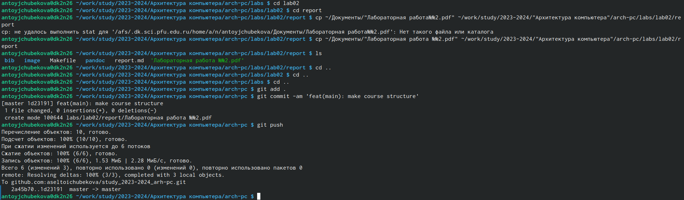

---
## Front matter
title: "Лабораторная работа №2"
subtitle: "Простейший вариант"
author: "Тойчубекова Асель Нурлановна"

## Generic otions
lang: ru-RU
toc-title: "Содержание"

## Bibliography
bibliography: bib/cite.bib
csl: pandoc/csl/gost-r-7-0-5-2008-numeric.csl

## Pdf output format
toc: true # Table of contents
toc-depth: 2
lof: true # List of figures
lot: true # List of tables
fontsize: 12pt
linestretch: 1.5
papersize: a4
documentclass: scrreprt
## I18n polyglossia
polyglossia-lang:
  name: russian
  options:
	- spelling=modern
	- babelshorthands=true
polyglossia-otherlangs:
  name: english
## I18n babel
babel-lang: russian
babel-otherlangs: english
## Fonts
mainfont: PT Serif
romanfont: PT Serif
sansfont: PT Sans
monofont: PT Mono
mainfontoptions: Ligatures=TeX
romanfontoptions: Ligatures=TeX
sansfontoptions: Ligatures=TeX,Scale=MatchLowercase
monofontoptions: Scale=MatchLowercase,Scale=0.9
## Biblatex
biblatex: true
biblio-style: "gost-numeric"
biblatexoptions:
  - parentracker=true
  - backend=biber
  - hyperref=auto
  - language=auto
  - autolang=other*
  - citestyle=gost-numeric
## Pandoc-crossref LaTeX customization
figureTitle: "Рис."
tableTitle: "Таблица"
listingTitle: "Листинг"
lofTitle: "Список иллюстраций"
lotTitle: "Список таблиц"
lolTitle: "Листинги"
## Misc options
indent: true
header-includes:
  - \usepackage{indentfirst}
  - \usepackage{float} # keep figures where there are in the text
  - \floatplacement{figure}{H} # keep figures where there are in the text
---

# Цель работы
Целью работы является изучить идеологию и применение средств контроля версий.
Приобрести практические навыки по работе с системой git. Изучить общие понятие систем
контроля версии, систему GIT, научиться использовать основные команды git, работать с
системой при наличии центрального репозитория, базовым настройкам github и git, создавать
SSH-ключи, создавать рабочее пространство.

# Задание
Ознакомиться с системой контроля версии GIT. Изучить:
-основные команды git,
-работу с системой при наличии центрального репозитория,
-настройки github,
-базовые настройки git,
-создание SSH-ключи,
-Сознание рабочего пространства и репозитория курса на основе шаблона,
-Сознание репозитория курса на основе шаблона, который был предоставлен в ходе
лабораторной работы №2,
-как настроить каталог курса.
Задание для самостоятельной работы:
-Создать отчет по выполнению лабораторной работы в соответствующем каталоге рабочего
пространства (labs>lab01>report).
2.Скопировать отчеты по выполнению предыдущих лабораторных работ, то есть
лабораторную работу№1, в соответствующие каталоги созданного рабочего пространства.
3.Загрузить файлы на github.
# Теоретическое введение
Системы контроля версий (Version Control Systems, VCS) — это инструменты, которые
позволяют отслеживать изменения в исходном коде и других файлах проекта, а также
облегчают коллаборацию между разработчиками. Они предоставляют возможность
возвращаться к предыдущим версиям кода, сравнивать и сливать изменения, а также
разрешать конфликты в коде.
В классических системах контроля версий используется централизованная модель,
предполагающая наличие единого репозитория для хранения файлов
Функции системы контроля версий:
• Хранение несколько версий одного и того же документа (история версий),
• Хранение истории разработки,
• При необходимости возвращение к более ранним версиям документа (отмена
изменений);
• определение, кто и когда сделал изменение (поиск «виновного»),
• совмещение изменений сделанных разными разработчиками (синхронизация работы команды)
• реализация альтернативных/эксперементальных вариантов проекта.
Среди классических VCS наиболее известны CVS, Subversion, а среди распределённых —
Git, Bazaar, Mercurial. Принцип их работы схож, они отличатся лишь синтаксисом
используемых в работе команд.
Контроль версии Git — представляет собой набор программ командной строки, это
распределенная система контроля версий, что означает, что каждый разработчик имеет свою
собственную копию репозитория с полной историей изменений. Рассмотрим основные
команды для работы с Git  (рис. @fig:001).

{#fig:001 width=70% }

При наличии центрального репозитория пользователь может начать работу с проверки и
получения изменений из центрального репозитория, а затем уже вносить изменения в
локальное дерево или ветки, а дальше после всех изменений можно сохранить и отправить
изменения в центральный репозиторий.
# Выполнение лабораторной работы
**Настройка GITHUB.**
Для начала работы нам нужно настроить github. Создадим учётную запись на сайте
https://github.com/ и заполним основные данные. После всего заполнения у нас появится свой
аккаунт, где мы можем создавать свои репозитории и работать над своими проектами.
Созданный аккаунт показан на (рис. @fig:002)

{#fig:002 width=70% }

**Базовая настройка Git.**
Сперва сделаем предварительную конфигурацию git. Открыв терминал используя команды
git такие как: git config –global, указываем свое имя, как в аккаунте в github, и свой email.
Далее требуется подождать некоторое время, а после выполнении конфигурации настроим
utf-8 в выводе сообщений git.
Далее зададим имя начальной ветки, будем называть ее “master”. Также зададим параметры.
Результат проделанной работы можно наблюдать на (рис. @fig:003)

{#fig:003 width=70% }

**Создание SSH-ключа.**
Для последующей идентификации пользователя на сервере репозиториев сгенерируем пару
ключей (приватный и открытый). Далее зайдя на сайт github под своей учетной записью
перейдем в настройки и выберем в боковом меню SSH and GPG keys, нажав кнопку New SSH
key и вставив на указанном поле скопированный из консоли , с помощью команды cat, ключ
загрузим сгенерированный открытый ключ. Укажем имя Title для ключа. Проведенную
работу в командной строке мы видим на (рис. @fig:004)

{#fig:004 width=70% }

Можно убедиться, что все сделано правильно, зайдя в Github, перезагрузить аккаунт, и
увидеть, что ключ загружен. (рис. @fig:005)

{#fig:005 width=70% }

**Сознание рабочего пространства и репозитория курса на основе шаблона.**
При выполнении лабораторных работ мы должны придерживаться структуры рабочего пространства иерархия которого выглядит так (рис. @fig:006):

{#fig:006 width=70% }

Также учтем, что название проекта предмета “Архитектура компьютера” примет следующий
вид: study_2023 2024_arch-pc Далее откроем терминал и создадим каталог для предмета “Архитектура компьютера”.
Используя команду cd и перейдя в этот каталог, убедились, что каталог создан. ((рис. @fig:007))
**Сознание репозитория курса на основе шаблона.**
Создадим репозиторий на основе шаблона, на который мы перейдем по ссылки https://github.com/yamadharma/course-directory-student-template. После того как мы перешли по ссылке создадим свой репозиторий на основе шаблона и именем study_2023– 2024_arh-pc. Перейдя на свой аккаунт в github мы видим, что репозиторий удачно создан, обратим внимание на (рис. @fig:008)

{#fig:007 width=70% }

{#fig:008 width=70% }

Далее откроем терминал и перейдем в каталог курса. Затем скопируем, созданный репозиторий. Ссылку для клонирования возьмем на странице созданного репозитория Code -> SSH. Клонирование репозитория необходимо, чтобы начать в нем что-то менять. Введя команды для клонирования далее из результата нашей команды видно, что наш репозиторий клонирован. ((рис. @fig:009))

{#fig:009 width=70% }
**Настройка каталога курса**
Перейдём в каталог курса в arch-pc. Далее удаляем лишние файлы, которые не хотим отправлять в центральный репозиторий, а точно файл package. Json. Используя команду ls увидели, что файл удален. Вместе с тем создадим необходимый каталог course. Выполняя все команды мы можем видеть результат на экране, (рис. @fig:010)

{#fig:010 width=70% }

В конце отправим файлы на сервер. С помощью команды ls или же зайдя в свой аккаунт в github, удостоверились что, создания иерархии рабочего пространства в локальном репозитории и на странице github произвелось правильно. Результат выполненной работы изложен на (рис. @fig:011, @fig:012, @fig:013)

{#fig:011 width=70% }

{#fig:012 width=70% }

{#fig:013 width=70% }

{#fig:014 width=70% }

{#fig:015 width=70% }

**Задание для самостоятельной работы.**
Скопируем отчет по выполненной лабораторной работе№1 в соответствующие каталоги созданного рабочего пространства(labs->lab01->report). Зайдя в свой аккаунт в github, затем перейдя в репозиторий по предмету “Архитектура компьютера”, в указанные каталоги мы видим, что все успешно загрузилось. (рис. @fig:016) и (рис. @fig:017) Дальше, так же загрузим и отчет по проделанной лабораторной работе №2.

{#fig:016 width=70% }

{#fig:017 width=70% }

Теперь загрузим лабораторную работу номер два в соответствующий каталог(labs->lab02- >report). На (рис. @fig:018) мы можем просмотреть процесс загрузки, а на (рис. @fig:019) проверку в github

{#fig:018 width=70% }

{#fig:019 width=70% }

# Выводы
В процессе выполнения лабораторной работы №2 я изучила идеологию и применения средств контроля версий, ее функции и разнообразие. Я приобрела практические навыки по работе с одной из популярных систем контроля версии, с системой git. Познакомилась с основными командами git и с web-сервисом github, который требуется для работы с git. Создала рабочее пространство и репозиторий на основе шаблона и SSH-ключи, также научилась работать с каталогами курса, рабочего пространства. А в конце пользуясь приобретенными знаниями загрузила отчет по лабораторной работе№1 и лабораторную работу№2 в соответствующие каталоги, созданного мной репозитория.

::: {#refs}
:::
