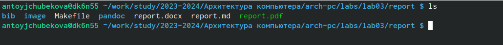

---
## Front matter

title: "Лабораторная работа №3"
subtitle: "Простейший вариант"
author: "Тойчубекова Асель Нурлановна"

## Generic otions
lang: ru-RU
toc-title: "Содержание"

## Bibliography
bibliography: bib/cite.bib
csl: pandoc/csl/gost-r-7-0-5-2008-numeric.csl

## Pdf output format
toc: true # Table of contents
toc-depth: 2
lof: true # List of figures
lot: true # List of tables
fontsize: 12pt
linestretch: 1.5
papersize: a4
documentclass: scrreprt
## I18n polyglossia
polyglossia-lang:
  name: russian
  options:
	- spelling=modern
	- babelshorthands=true
polyglossia-otherlangs:
  name: english
## I18n babel
babel-lang: russian
babel-otherlangs: english
## Fonts
mainfont: PT Serif
romanfont: PT Serif
sansfont: PT Sans
monofont: PT Mono
mainfontoptions: Ligatures=TeX
romanfontoptions: Ligatures=TeX
sansfontoptions: Ligatures=TeX,Scale=MatchLowercase
monofontoptions: Scale=MatchLowercase,Scale=0.9
## Biblatex
biblatex: true
biblio-style: "gost-numeric"
biblatexoptions:
  - parentracker=true
  - backend=biber
  - hyperref=auto
  - language=auto
  - autolang=other*
  - citestyle=gost-numeric
## Pandoc-crossref LaTeX customization
figureTitle: "Рис."
tableTitle: "Таблица"
listingTitle: "Листинг"
lofTitle: "Список иллюстраций"
lotTitle: "Список таблиц"
lolTitle: "Листинги"
## Misc options
indent: true
header-includes:
  - \usepackage{indentfirst}
  - \usepackage{float} # keep figures where there are in the text
  - \floatplacement{figure}{H} # keep figures where there are in the text
---

# Цель работы
Целью работы является освоение процедуры оформления отчетов с помощью легковесного языка разметки Markdwn.

# Задание
Ознакоиться с базовыми сведениями о Markdown, как именно с ней работать.Изучить:
-основные сведения об обработке текста в Markdown,
-оформление формул в Markdown,
-oформление изображений в Markdown,
-обработку файлов в формате Markdown,
-как проводить компиляцию в использованием Makefile,
-как удалять, полученные в ходе компиляций, файлы с импользованием Makefile.
Задание для самостоятельной работы:
1.В соответствующем каталоге сделать отчет по лабораторной работе №2 в формате Markdown.В качестве отчета необходимо предоставить отчеты в трех форматах:pdf,docx и md.
2.Загрузить файлы на github.

# Теоретическое введение
**Markdown** -  это облегченный язык разметки для форматирования текстового документов. Markdown – файлы без потерь преобразуются в другие документы( например html, pdf), открывается в любом текстовом редакторе и будут поняты любому человеку даже в виде исходного кода. Используя различные знаки мы можем редактировать текст, например:
'#'-для создания заголовка
'** **'- для создания полужирного начертания текста
'**'-для курсивного начертания курсива
'>'-блок цитирования
'*' ; '- '; '1.' -для упорядоченного, неупорядоченного, вложенного списка
Для встроенной 0ссылки действует схема [link text](file-name.md) или [link text](http://example.com/ "Необязательная подсказка").
Также существуют определенные правила по оформлению тех или иных формул и изображений в Markdown. В Markdown вставить изображение в документ можно с помощью непосредственного указания адреса изображения. C помощью команды pandoc  мы можем обработать файлы.
# Выполнение лабораторной работы
Для начало откроем терминал и перейдем в каталог курса, сформированный при выполнении лабораторной работы №2,с помощью команды git pull обновим локальный репозиторий. На РИС1.1 мы видим, что никаких изменений в репозитории не было.
{#fig:001 width=70%}
Затем перейдя в каталалог с шаблоном отчета по лабораторной работе №3,проведем компиляцию шаблона с использованием Makefile(РИС.1.2).
{#fig:002 width=70%}
Используя команду ls на мы видим,что файлы report.pdf и repor.docx удачно сгенерировались. (РИС.1.3)
{#fig:003 width=70%}
Дальше удалим полученные файлы с использованием Makefile, также вводя команду ls замети,что файлы удалены(РИС.1.4)
{#fig:004 width=70%}
Откроем файл report.md с помощью текстового редактора gedit.Внимательно изучив структуру файла, заполним и скомпилируем отчет с использованием Makefile. Проверим коректность полученных файлов и загрузим файлы на Github.
**Задание для самостоятельной работы**
Перейдем в каталог курса, перейдем в соответствующий файл (labs->lab02->report), далее используя текстовый редактор gedit откроем файл report.md(РИС.2.1)
![РИС.2.1 Создание отчета по лабораторной работе№2 в Markdown]

# Выводы
В ходе выполнения лабораторной работы №3 были изучены процедуры освоения оформления отчетов с помощью легковесного языка разметки Markdown.Я узнала базовые сведения о Markdown:
как оформлять те или иные тексты и таблицы,изображения, как обрабатывать файлы в формате Markdown. Используя полученные навыки сделала отчет по лабораторной работе №2 в формате Markdown и загрузила все полученные файлы(pdf,docx,md) в github

# Список литературы{.unnumbered}
<-https://esystem.rudn.ru/course/view.php?id=4975>
<-https://learn.microsoft.com/ru-ru/contribute/content/markdown-reference>
<-https://skillbox.ru/media/code/chto-takoe-markdown-i-zachem-on-nuzhen-redaktory-dialekty-otlichiya-ot-html/?ysclid=lnlv0o9ezt785770327>
<-https://dzen.ru/a/Y1e-IN8IAnIWZ8kD>

