---
## Front matter
title: "Лабораторная работа№4"
subtitle: "Дисциплина:Архитектура компьютера"
author: "Тойчубекова Асель Нурлановна"

## Generic otions
lang: ru-RU
toc-title: "Содержание"

## Bibliography
bibliography: bib/cite.bib
csl: pandoc/csl/gost-r-7-0-5-2008-numeric.csl

## Pdf output format
toc: true # Table of contents
toc-depth: 2
lof: true # List of figures
lot: true # List of tables
fontsize: 12pt
linestretch: 1.5
papersize: a4
documentclass: scrreprt
## I18n polyglossia
polyglossia-lang:
  name: russian
  options:
	- spelling=modern
	- babelshorthands=true
polyglossia-otherlangs:
  name: english
## I18n babel
babel-lang: russian
babel-otherlangs: english
## Fonts
mainfont: PT Serif
romanfont: PT Serif
sansfont: PT Sans
monofont: PT Mono
mainfontoptions: Ligatures=TeX
romanfontoptions: Ligatures=TeX
sansfontoptions: Ligatures=TeX,Scale=MatchLowercase
monofontoptions: Scale=MatchLowercase,Scale=0.9
## Biblatex
biblatex: true
biblio-style: "gost-numeric"
biblatexoptions:
  - parentracker=true
  - backend=biber
  - hyperref=auto
  - language=auto
  - autolang=other*
  - citestyle=gost-numeric
## Pandoc-crossref LaTeX customization
figureTitle: "Рис."
tableTitle: "Таблица"
listingTitle: "Листинг"
lofTitle: "Список иллюстраций"
lotTitle: "Список таблиц"
lolTitle: "Листинги"
## Misc options
indent: true
header-includes:
  - \usepackage{indentfirst}
  - \usepackage{float} # keep figures where there are in the text
  - \floatplacement{figure}{H} # keep figures where there are in the text
---

# Цель работы

Целью работы является освоение процедуры компиляции и сбоки программ, написанных на ассемблере NASM.

# Задание

* Понять основные принципы работы компьютера:

 -работа АЛУ;\
 -устройство управления;\
 -работа регистров;\
 -устройство внешней памяти;\
 -устройства ввода-вывода.
 
* Познакомиться с ассемблером и языком ассемблера:

 -как создавать и обрабатывать программы на языке ассемблер;\ 
 -общие понятия о языке ассемблера NASM;\
 -работа транслятора NASM;\
 -работа командной строки NASM;\
 -работа комповщика;\
 -как запустить исполняемый файл.
 
* Написать программу для вывода на экран "Hello world".

* Задание для самостоятельной работы:

1. В каталоге ~/work/arch-pc/lab04 с помощью команды cp создать копию файла
hello.asm с именем lab4.asm
2. С помощью любого текстового редактора внести изменения в текст программы в
файле lab4.asm так, чтобы вместо Hello world! на экран выводилась строка с фамилией и именем.
3. Оттранслировать полученный текст программы lab4.asm в объектный файл. Выполнить
компоновку объектного файла и запустить получившийся исполняемый файл.
4. Скопировать файлы hello.asm и lab4.asm в наш локальный репозиторий в ката-
лог ~/work/study/2023-2024/"Архитектура компьютера"/arch-pc/labs/lab04/.
Загрузить файлы на Github.

# Теоретическое введение

 Основными функциональными элементами любой электронно-вычислительной машины
(ЭВМ) являются центральный процессор, память и периферийные устройства, их взаимодействие осуществляется через общую шину, к которой они подключены. 
  В состав центрального процессора входят:
  
- арифметико-логическое устройство(АЛУ);

- устройство управления(уу);

- регистры.

Другим важным узлом ЭВМ является оперативное запоминающее устройство (ОЗУ).
ОЗУ — это быстродействующее энергозависимое запоминающее устройство, которое на-
прямую взаимодействует с узлами процессора, предназначенное для хранения программ и
данных, с которыми процессор непосредственно работает в текущий момент.

В состав ЭВМ также вхождят периферийные устройства:
   
 - устройство внешней памяти;
 
 - устройства ввода-вывода;
 
  В основе вычислительного процесса ЭВМ лежит принцип программного управления, то компьютер решает задачу последовательно, следуя прогрвмме, записанная ввиде кодов. При выполнении каждой команды процессор выполняет определённую последовательность стандартных действий, которая называется командным циклом процессора. В самом общем виде он заключается в следующем:
  
1. формирование адреса в памяти очередной команды;
2. считывание кода команды из памяти и её дешифрация;
3. выполнение команды;
4. переход к следующей команде.

Язык Ассемблера (англ. «Assembler») — это низкоуровневый язык программирования, который представляет собой промежуточное звено между машинным кодом и высокоуровневыми языками программирования. Он используется для написания программ, которые управляют компьютером или другими устройствами на более низком уровне, непосредственно взаимодействуя с аппаратным обеспечением. Код, написанный на этом языке, обычно сохраняется с помощью расширения ASM. 
  
Программы на ассемблере пишутся в виде набора мнемонических инструкций, каждая из которых соответствует определенной команде процессора. Эти инструкции затем транслируются (ассемблируются) в машинный код — набор двоичных чисел, которые понимает центральный процессор и выполняет соответствующие операции. Для каждой архитектуры существует свой ассемблер и свой язык ассемблера.
 
  Ниже приведена РИС.1.1 с примерами кода, соответствующими инструкциями на ассемблере и их описание.
  
 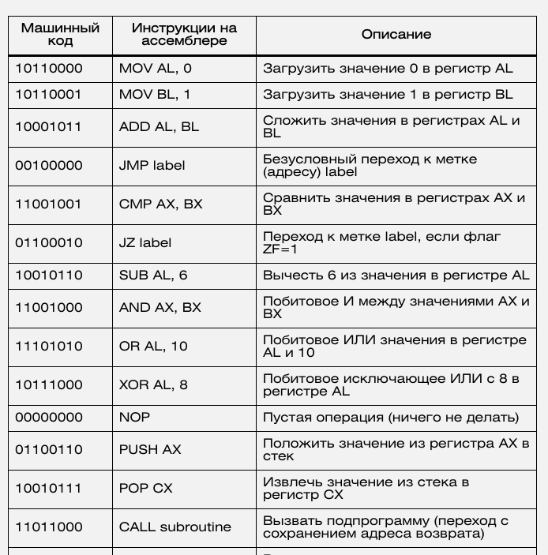{#fig:001 width=70%}
 
 NASM — это открытый проект ассемблера, версии которого доступны под различные
операционные системы и который позволяет получать объектные файлы для этих систем. В
NASM используется Intel-синтаксис и поддерживаются инструкции x86-64.

Типичный формат записи команд NASM имеет вид:
   [метка: мнемокод [операнд {, операнд}] [; комментарий]
   
В процессе создания ассемблерной программы можно выделить четыре шага:

- набор текста в соответствующий файл;

- трансляция текста а=прграммы с помощью транслятора,наприме nasm;

- компоновка или линковка;

- запуск программы.
   
# Выполнение лабораторной работы

## Программа Hello world! ##

Для начала создадим каталог для работы с программами на языке ассемблера NASM, затем перейдем в этот каталог.(РИС.2.1)

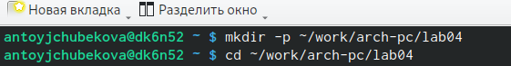{#fig:002 width=70%}

Создадим текстовый файл c именем hello.asm c помощью touch, затем откроем этот файл с помощью редактора report и напишем в него программу для вывода на экран Hello world!(РИС2.2_1) И (РИС.2.2_2)

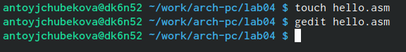{#fig:003 width=70%}

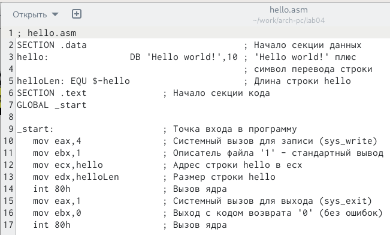{#fig:004 width=70%}

## Транслятор NASM ##

Дальше с помощью команды nasm -f elf hello.asm компилируем текст программы для вывода Hello world! в объективный код в новом файле hello.o, в формате ELF. Используя команду ls мы вмдим, что файл был создан.(РИС.3.1)

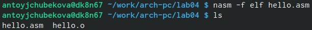{#fig:005 width=70%}

## Расширенный синтаксис командной строки NASM ##

Введем команду для компиляции файла hello.asm в файл obj.o, при этом формат выходного файла будет elf и в него будут включены символы для откладки (опции-g), также будет создан файл листинга list.lst(опции-l). С помощью команды ls мы удостоверились, что все файлы были правильно созданы.(РИС.4.1)

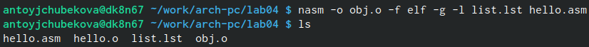{#fig:006 width=70%}

## Компоновщик LD ##

Дальше передадим объективный файл hello.o на обработку комповщику LD используя команду "d -m elf_i386 hello.o -o hello". Дальше проверяем корректность выполнения команды,введя команду ls.(РИС.5.1) 

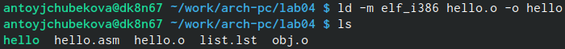{#fig:007 width=70%}

Дальше введем команду "d -m elf_i386 obj.o -o main". Исполняемый файл будет иметь имя main, так как после ключа -о было задано значение main. Проверим наличие файлов командой ls.Объективный файл, из которого собран этот испоняемый файл, имеет имя obj.o. (РИС.5.2)

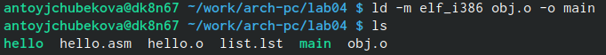{#fig:008 width=70%}

## Запуск исполняемого файла ##

Запускаем на выполнение созданный исполняемый файл hello и види, что она успешно запустиласью(РИС.6.1)

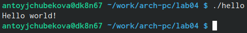{#fig:009 width=70%}

## Задание для самостоятельной работы ##

Для начала в каталоге ~/work/arch-pc/lab04 с помощью команды cp создадим копию файла
hello.asm с именем lab4.asm. С помщью ls проверим их наличие(РИС.7.1)

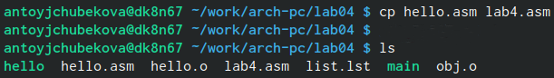{#fig:010 width=70%}

 С помощью текстового редактора gedit вношу изменения в текст программы в
файле lab4.asm так, чтобы на экран выводилась мое фамилие и имя.(РИС.7.2)

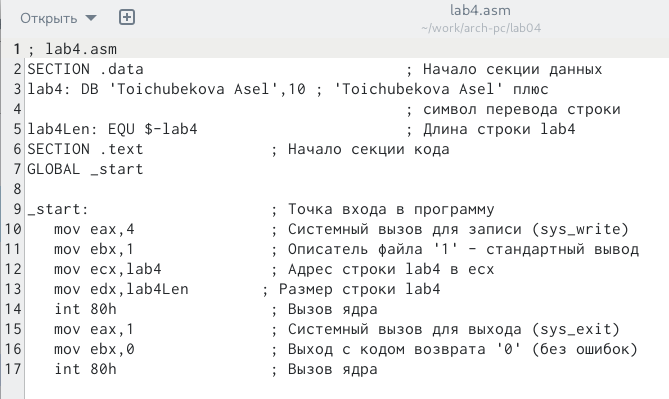{#fig:011 width=70%}

Оттранслируем полученный текст программы lab4.asm в объектный файл. С помощью команды ls мы видим, что файл lab4.o был создан.(РИС.7.3)

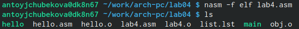{#fig:012 width=70%}

Далее выполним компоновку объектного файла, с компоновщиком ld. Введя команду ls можно заметить, что исполняемый файл lab4 существует.(РИС.7.4)

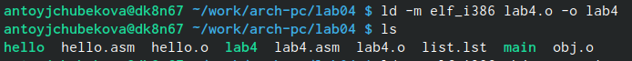{#fig:013 width=70%}

Запустим получившийся исполняемый файл.(РИС.7.5)

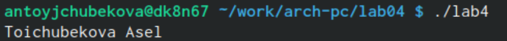{#fig:014 width=70%}

Скопируем файлы hello.asm и lab4.asm в наш локальный репозиторий в каталог- ~/work/study/2023-2024/"Архитектура компьютера"/arch-pc/labs/lab04/. Перейдя в наш репозиторий и с командой ls видим, что все скопировалось.(РИС.7.6)

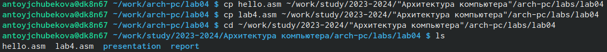{#fig:015 width=70%}

Загрузим файлы на Github и проверим их наличие.(РИС.7.7) И (РИС.7.8).

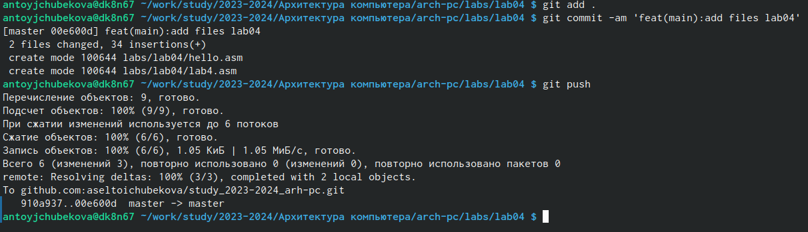{#fig:016 width=70%}

{#fig:017 width=70%}

# Выводы

В ходе выполнения лабораторной работы №4 я поняла основные принципы компьютера, познакомилась с понятием ассемблер и с языком ассемблера NASM, освоила процедуры комиляции и сборки программ, написанных на ассемблере NASM. Пользуясь полученными знаниями написала программу на языке ассемблера NASM, выводящяя на экран фразу "Hello world!" и мое имя и фамилие.

# Список литературы{.unnumbered}

-https://esystem.rudn.ru/course/view.php?id=4975\
-https://skillbox.ru/media/code/chto-takoe-assembler/\
-https://www.google.com/url?sa=t&rct=j&q=&esrc=s&source
