---
## Front matter
title: "Лабораторная работа №5"
subtitle: "Архитектура компьютера"
author: "Тойчубекова Асель Нурлановна"

## Generic otions
lang: ru-RU
toc-title: "Содержание"

## Bibliography
bibliography: bib/cite.bib
csl: pandoc/csl/gost-r-7-0-5-2008-numeric.csl

## Pdf output format
toc: true # Table of contents
toc-depth: 2
lof: true # List of figures
lot: true # List of tables
fontsize: 12pt
linestretch: 1.5
papersize: a4
documentclass: scrreprt
## I18n polyglossia
polyglossia-lang:
  name: russian
  options:
	- spelling=modern
	- babelshorthands=true
polyglossia-otherlangs:
  name: english
## I18n babel
babel-lang: russian
babel-otherlangs: english
## Fonts
mainfont: PT Serif
romanfont: PT Serif
sansfont: PT Sans
monofont: PT Mono
mainfontoptions: Ligatures=TeX
romanfontoptions: Ligatures=TeX
sansfontoptions: Ligatures=TeX,Scale=MatchLowercase
monofontoptions: Scale=MatchLowercase,Scale=0.9
## Biblatex
biblatex: true
biblio-style: "gost-numeric"
biblatexoptions:
  - parentracker=true
  - backend=biber
  - hyperref=auto
  - language=auto
  - autolang=other*
  - citestyle=gost-numeric
## Pandoc-crossref LaTeX customization
figureTitle: "Рис."
tableTitle: "Таблица"
listingTitle: "Листинг"
lofTitle: "Список иллюстраций"
lotTitle: "Список таблиц"
lolTitle: "Листинги"
## Misc options
indent: true
header-includes:
  - \usepackage{indentfirst}
  - \usepackage{float} # keep figures where there are in the text
  - \floatplacement{figure}{H} # keep figures where there are in the text
---

# Цель работы
Целью данной лаборатрной работы является приобретение практических навыков работы в Midnight Commander.Также освоение инструкций языка ассемблера mov и int.

# Задание
* Понять основы работы с Midnight Commander.
* Познакомиться со структурой программы на языке ассемблера NASM:
 -Секции ассемблера NASM;\
  -Директивы.\
* Изучить структуру иструкции языке ассемблера mov.
* Изучить структуру инструкции языка ассемблера int.
* Познакомиться с системными вызовами для обеспечения диалога с пользователями.
* Научиться писать программу для вывода сообщения на экран и ввода строки с клавиатуры, используя пример.
* Научиться подключать внешний файл in_out.asm и написать программу вывода сообщения на экран и ввода строки с клавиатуры с использованием файла in_out.asm.
* Задание для самостоятельной работы
1. Создайте копию файла lab5-1.asm. Внесите изменения в программу (без использова-
ния внешнего файла in_out.asm), так чтобы она работала по следующему алгоритму:\
• вывести приглашение типа “Введите строку:”;\
• ввести строку с клавиатуры;\
• вывести введённую строку на экран
2. Получите исполняемый файл и проверьте его работу. На приглашение ввести строку
введите свою фамилию.
3. Создайте копию файла lab5-2.asm. Исправьте текст программы с использование под-
программ из внешнего файла in_out.asm, так чтобы она работала по следующему
алгоритму:\
• вывести приглашение типа “Введите строку:”;\
• ввести строку с клавиатуры;\
• вывести введённую строку на экран.
4. Создайте исполняемый файл и проверьте его работу.

# Теоретическое введение

Midnight Commander (mc, МС) – текстовая полнофункциональная программа, которая позволяет пользователю копировать, перемещать и удалять файлы и директории, производить поиск файлов и запускать на выполнение команды оболочки. Также в него встроен редактор и программа для просмотра файлов.В Midnight Commander используются функциональные клавиши, к которымм привязаны часто выполняемые операции.

Программа на языке ассемблера NASM состоит из трех секций: секция кода программы-SECTION .text, секция инициированных данных-SECTION .data,секция неинициализированных данных-SECTION .bss.
Для объявления инициированных и неинициированных данных используют директивы(DB, DW, DD, DQ и DT; ы resb, resw, resd).

Инструкция mov 

Инструкция языка ассемблера mov предназначена для дублирования данных источника в приёмнике. В качестве операнда могут выступать регистры (register), ячейки памяти (memory) и непосредственно значение const.

Инструкция int 

Инструкция языка ассемблера int предназначена для вызова прерывания с указанным номером. В общем виде она записывается в виде int n .Здесь n — номер прерывания, принадлежащий диапазону 0–255. При программировании в Linux с использованием вызовов ядра sys_calls n=80h (принято задавать в шестнадцатеричной системе счисления).

# Выполнение лабораторной работы

 Открывем Midnight Commander с помощью команды mc. Затем переходим в каталог  ~/work/arch-pc, созданный нами привыполении лабораторной работы №4.(РИС.1) и (РИС.2)

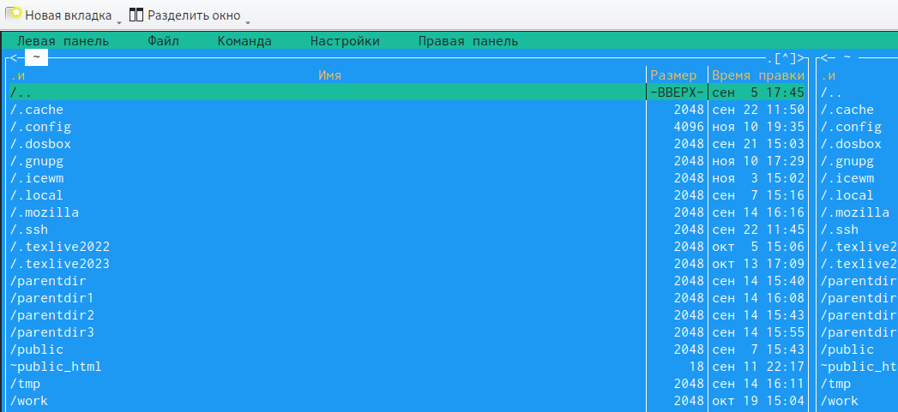{#fig:001 width=70%}

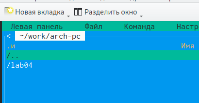{#fig:002 width=70%}

С помощью функциональной клавиши F7 создаем каталог lab5 и перейдем в него. Мы видим,что каталог  был удачно создан(РИС.3) и (РИС.3.1)

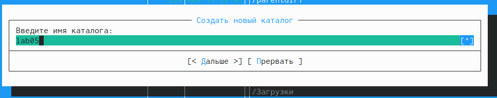{#fig:003 width=70%}

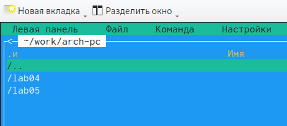{#fig:004 width=70%}

Пользуясь строкой ввода и командой touch создам файл lab5-1.asm (РИС.4) и (РИС4.1)

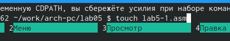{#fig:005 width=70%}

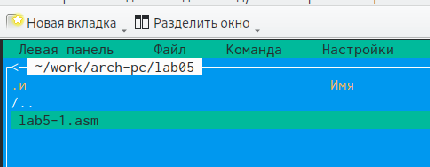{#fig:006 width=70%}

С помощью функциональной клавиши F4 открывае созданный файл для редактирования в редакторе nano. Затем введем в нее программу для вывода сообщения на экран и ввода строки с клавиатуры. Используя комбинацию клавиш Y,ENTER сохроняем изменения, и выходим из редактора с X,Ctrl.(РИС.5)

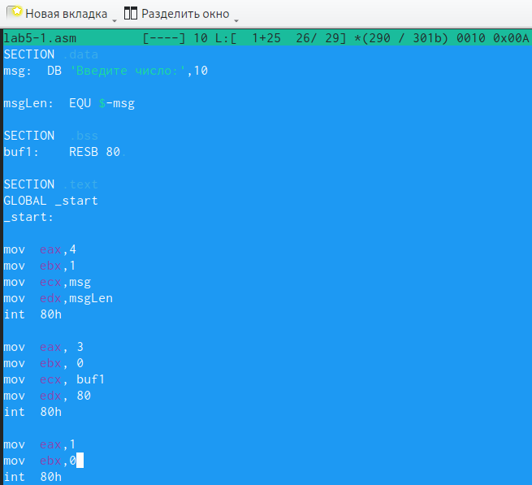{#fig:007 width=70%}

Далее с клавишей F3 откроем файл для просмотра и видим, что файл содержит текст программы.(РИС.6)

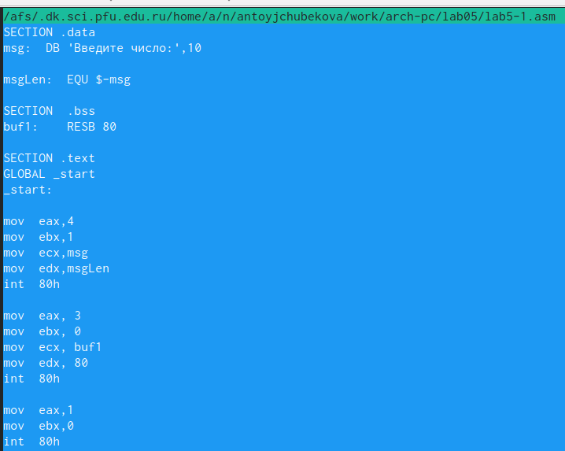{#fig:008 width=70%}

Оттранслируем текст программы lab5-1.asm в объектный файл используя команду "nasm -f elf lab5-1.asm" Далее выполним компоновку объектного файла с помощью компоновщика ld .(РИС.7)

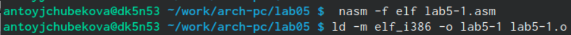{#fig:009 width=70%}

Запускаем полученный иполняемыйфайл, после того как программа выведет строку "Введите строку:" и будет ждать ввода с клавиатуры введем наше ФИО.(РИС.8)

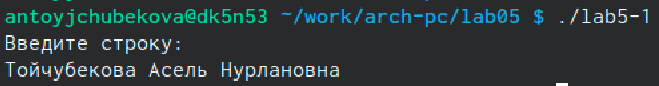{#fig:010 width=70%}

## Подключение внешнего файла in_out.asm ##

Скачиваем файл in_out.asm со страницы курса в ТУИС. Зайдя в загрузки мы видим,что файл был сохранен в каталоге "Загрузки"(РИС.9)

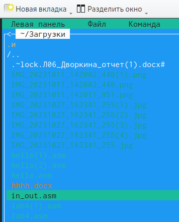{#fig:0011 width=70%}

С помощью функциональной клавиши F5 копируем файл in_out.asm в каталог с файлом lab5-1.asm.(РИС.10) и (РИС.10.1)

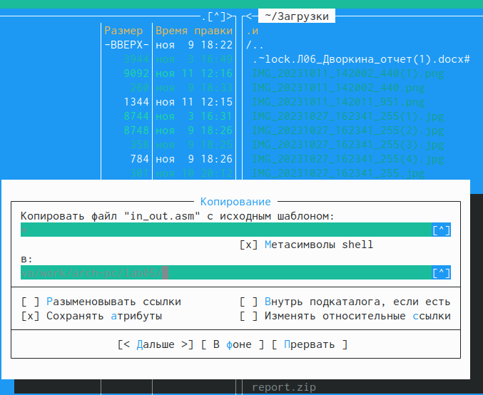{#fig:012 width=70%}

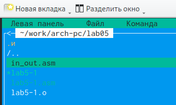{#fig:013 width=70%}

Используя функциональную клавишу F6 создадим копию файла lab5-1.asm в этот же каталог, толькос именем lab5-2.asm (РИС.11)

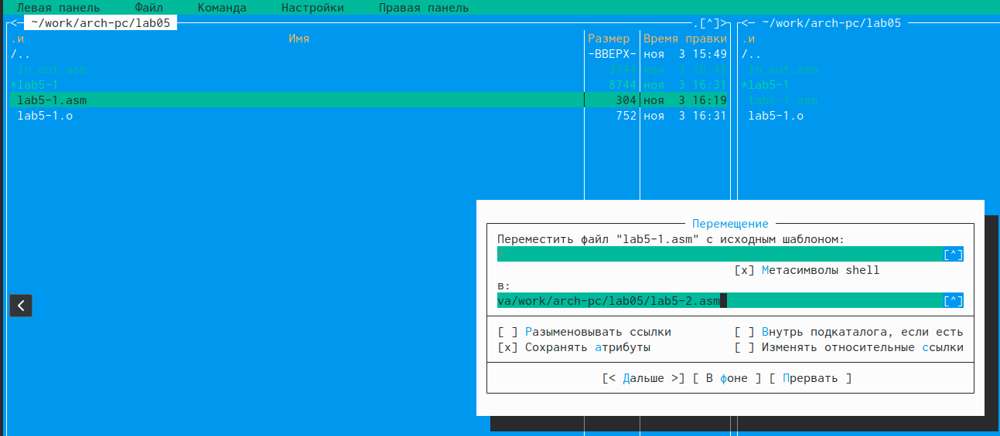{#fig:014 width=70%}

Зайдем в файл lab5-2.asm и редактируем программу, которая в ней записана так, чтобы программа работа с помощью подпрограмм из внешнего файла in_out.asm.(РИС.12)

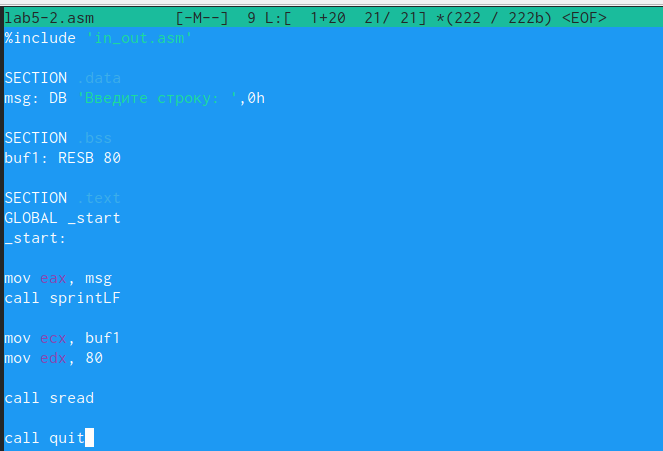{#fig:015 width=70%}

Далее транслируем текст программы в объективный файл с помощью команды nasm -f elf lab5-2.asm. Созданный объективный файл передаю комповщику ld и с помощью команды ld -m elf_i386-o lab5-2 lab5-2.o создается исполняемый файл, который мы далее запускаем.(РИС.13)

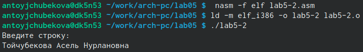{#fig:0016 width=70%}

Открываем файл lab5-2 и редактируем программу заменяя подпрограмму sprintLF и sprint. Сохроняем изменения и открываем файл и видим, что изменения были сохранены(РИС.14)

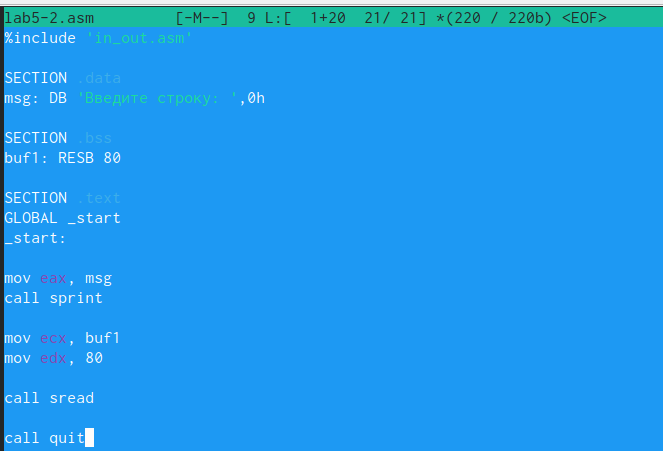{#fig:017 width=70%}

 Транслируем файл и выполняем компоновку, затем запускаем исполняемый файл. На РИС.15 мы видим, что разница между двумя исполняемыми файлами заключается в том, что запуск первого запрашивает ввод с новой строки, а во втором случае запрашивает ввод без переноса на новую строку, так как в этом и заключается различие между подпрограммами sprintLF и sprint.
 
 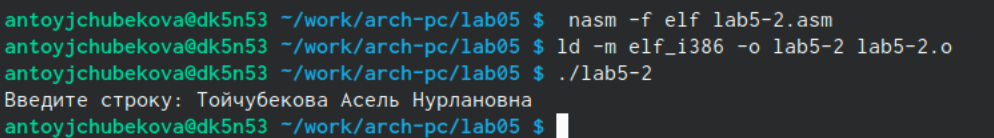{#fig:018 width=70%}
 
## Задание для самостоятельной работы ##

1. Применяя функциональную клавишу F5 создаем копию файла lab5-1.asm с именем lab5-1-1.asm.(РИС.16)

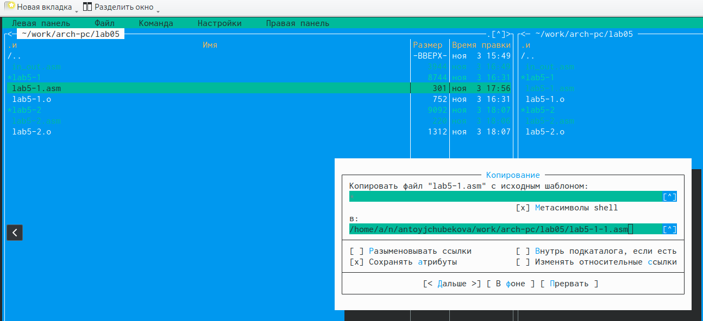{#fig:019 width=70%}

 Открываем этот файл с помощью функциональной клавиши F4 и редактируем программу так, чтобы кроме вывода приглашение типа "Введите строку:" программа выводила на экран введенную нами строку.(РИС.17) Измененная программа выглядит следующим образом:
 
SECTION .data \
msg: DB 'Введите строку:',10 \
msgLen: EQU $-msg \

SECTION .bss \
buf1: RESB 80 \

SECTION .text \
GLOBAL _start \
_start: \

mov eax,4 \
mov ebx,1 \
mov ecx,msg \
mov edx,msgLen \
int 80h \

mov eax, 3 \
mov ebx, 0 \
mov ecx, buf1 \
mov edx, 80 \
int 80h \

mov eax,4 ;Системный вызов для записи (sys_write) \
mov ebx,1 ;Описание файла 1- стандартный вывод \
mov ecx,buf1 ;Адрес строки buf1 в ecx \
mov edx,buf1 ; Размер строки buf1 \
int 80h ;Вызов ядра \

mov eax,1 \
mov ebx,0 \
int 80h \
 
 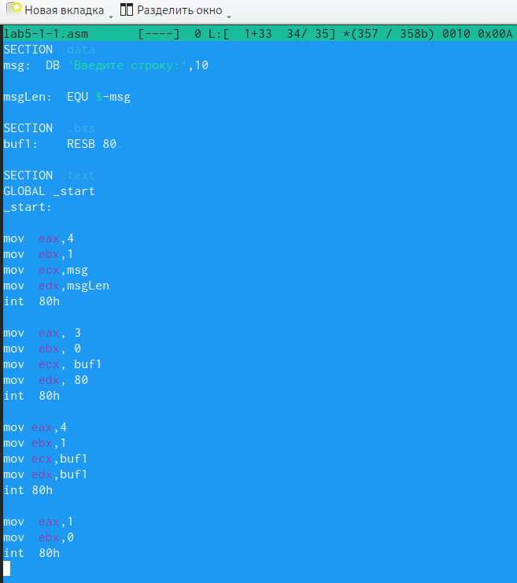{#fig:020 width=70%}
 
2. Транслируем файл и выполняем компоновку. Запустив исполняемый файл и введя свое ФИО на приглашение мы видим, что все выполняется правильно и выводит введенную нами строку.(РИС.18)
 
 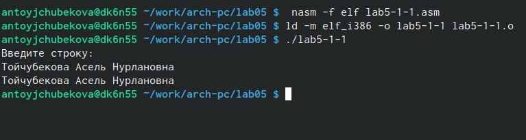{#fig:021 width=70%}
 
3. Также используя клавишу F5 создaдим копию файла lab5-2.asm с именем lab05-2-1.asm. Можно заметить,что копия файла с успехом была создана(РИС.19)

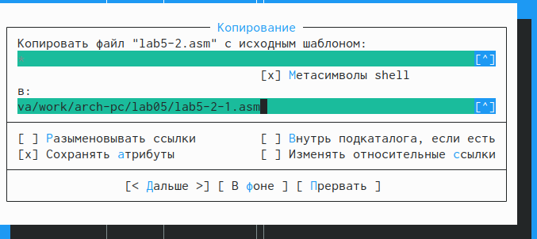{#fig:022 width=70%}

 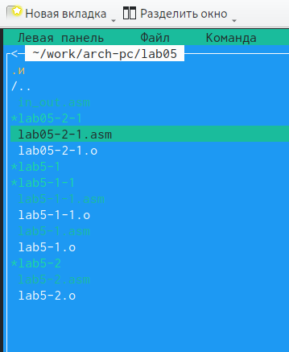{#fig:023 width=70%}

С F4 открываю созданный файл и редактирую программу так, чтобы кроме вывода приглашение типа "Введите строку:" программа выводила на экран введенную нами строку.(РИС.20) 
Измененная программа выгладин слкдующим образом:

%include 'in_out.asm' \

SECTION .data \
msg: DB 'Введите строку: ',0h \

SECTION .bss \
buf1: RESB 80 \

SECTION .text \
GLOBAL _start \
_start: \

mov eax, msg \
call sprint \

mov ecx, buf1 \
mov edx, 80 \

call sread \
mov eax,4 ;Системный вызов для записи (sys_write) \
mov ebx,1 ;Описатель файла '1' - стандартный вывод \
mov ecx,buf1 ;Адрес строки buf1 в ecx  \
int 80h ;Вызов ядра \
call quit \

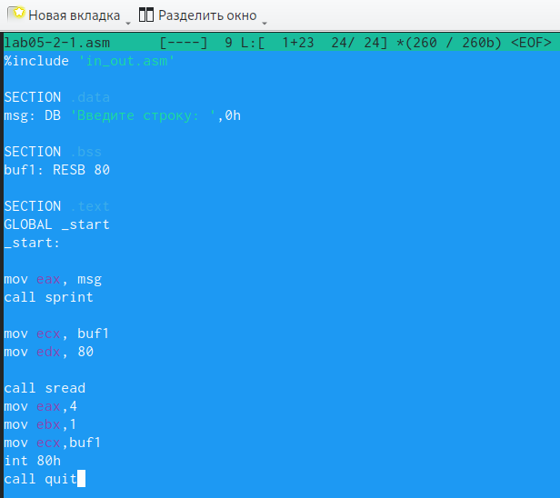{#fig:024 width=70%}

4. Транслируем отредактированный файл и выполняем компоновку. Запустив исполняемый файл мы видим, что программа запрашивает ввод без переноса на новую строку, введя свое ФИО, удостоверяемся, что программа выводит на экран введенные данные.(РИС.21)

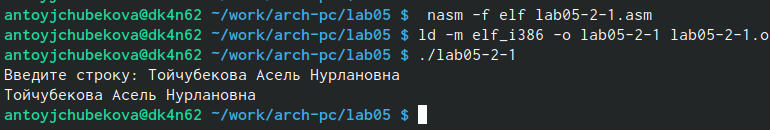{#fig:025 width=70%}

# Выводы

В ходе лабораторной работы №  5 я приобрела практические навыки в работе с Midnight Commander. Вместе с ттем освоила инструкции языка ассеемблера mov, int. Используя полученные навыки написала программу вывода сообщения на экран и ввода строки с клавиатуры, также написала ту же программу, только с использованием файла in_out.asm. Также написала программу которая на второй раз выводит введенный мной текст с использованием файла in_out.asm и без нее.

# Список литературы{.unnumbered}
 -https://esystem.rudn.ru/course/view.php?id=4975 \
 -https://redos.red-soft.ru/base/manual/utilites/mc-filemanager \
 -https://dzen.ru/list/gadgets/linux-mc-commander.
