---
## Front matter
title: "Лабораторная работа № 6"
subtitle: "Архитектура компьютера"
author: "Тойчубекова Асель Нурлановна"

## Generic otions
lang: ru-RU
toc-title: "Содержание"

## Bibliography
bibliography: bib/cite.bib
csl: pandoc/csl/gost-r-7-0-5-2008-numeric.csl

## Pdf output format
toc: true # Table of contents
toc-depth: 2
lof: true # List of figures
lot: true # List of tables
fontsize: 12pt
linestretch: 1.5
papersize: a4
documentclass: scrreprt
## I18n polyglossia
polyglossia-lang:
  name: russian
  options:
	- spelling=modern
	- babelshorthands=true
polyglossia-otherlangs:
  name: english
## I18n babel
babel-lang: russian
babel-otherlangs: english
## Fonts
mainfont: PT Serif
romanfont: PT Serif
sansfont: PT Sans
monofont: PT Mono
mainfontoptions: Ligatures=TeX
romanfontoptions: Ligatures=TeX
sansfontoptions: Ligatures=TeX,Scale=MatchLowercase
monofontoptions: Scale=MatchLowercase,Scale=0.9
## Biblatex
biblatex: true
biblio-style: "gost-numeric"
biblatexoptions:
  - parentracker=true
  - backend=biber
  - hyperref=auto
  - language=auto
  - autolang=other*
  - citestyle=gost-numeric
## Pandoc-crossref LaTeX customization
figureTitle: "Рис."
tableTitle: "Таблица"
listingTitle: "Листинг"
lofTitle: "Список иллюстраций"
lotTitle: "Список таблиц"
lolTitle: "Листинги"
## Misc options
indent: true
header-includes:
  - \usepackage{indentfirst}
  - \usepackage{float} # keep figures where there are in the text
  - \floatplacement{figure}{H} # keep figures where there are in the text
---

# Цель работы
Целью данной лабораторной работы является освоение арифметических инструкций языка ассемблера NASM.

# Задание

 - Познакомиться с адресацией в NASM.
 - Понять как производяться арифметические операции в NASM:
 -Целочисленное сложение add;\
 -Целочисленное вычитание sub;\
 -Команды инкремента и декремента;\
 -Команда изменения знака операнда neg;\
 -Команда умножения mul и imul;\
 -Команда деления div и idiv.\
 - Изучить как происходит переводсимвола числа в десятичную символьную запись.
 - Научиться писать программу вывода значения регистра eax, используя пример.
 - Научиться писать программу,которая вычисляет выражение F(x)= (5∗2 + 3)/3.
 - Научиться писать прграмму, вычисляющая вычесления варианта задания по номеру студенческого билета.
 - Задание для самостоятельной работы:
 1. Написать программу вычисления выражения y=F(x). Программа должна выводить
выражение для вычисления, выводить запрос на ввод значения x, вычислять задан-
ное выражение в зависимости от введенного x, выводить результат вычислений. Вид
функции F(x) выбрать из таблицы 6.3 вариантов заданий в соответствии с номером
полученным при выполнении лабораторной работы. Создайте исполняемый файл и
проверьте его работу для значений x1 и x2 из 6.3.

# Теоретическое введение

## Адресация в NASM ##

Существует три основных способа адресации:
- Регистровая адресация – операнды хранятся в регистрах и в команде используются
имена этих регистров, например: mov ax,bx.
- Непосредственная адресация – значение операнда задается непосредственно в ко-
манде, Например: mov ax,2.
- Адресация памяти – операнд задает адрес в памяти. В команде указывается символи-
ческое обозначение ячейки памяти, над содержимым которой требуется выполнить
операцию.

## Целочисленное сложение add ##

Команда add производит сложение двух операндов и записывает результат по адресу первого операнда.
Команду работает как с числами со знаком, так и без знака и выглядит следующим образом:\
add <операнд_1>,<операнд_2> 

## Целочисленное вычитание sub ##

Команда целочисленного вычитания sub работает анало- гично команде add и выглядит следующим образом:\
sub <операнд_1>, <операнд_2>

## Команды инкремента и декремента ##

Это команда отвечает за прибавление единицы - инкремент(int) и за ее вычитание - декремент(dec). Эти команды имеют следующий вид:\
inc <операнд> \
dec <операнд>.

## Команда изменения знака операнда neg ##

Команда neg рассматривает свой операнд как число со знаком и меняет знак операнда на противоположный. Это команда имеет вид:\
mov ax,1\
neg ax.

## Команды умножения mul и imul ##

Для беззнакового умножения используется команда mul:\
mul <операнд>.
Для знакового умножения используется команда imul:\
imul <операнд>.

## Команды деления div и idiv ##

Для деления, как и для умножения, существует 2 команды div и idiv:
div <делитель> - Беззнаковое деление;\
idiv <делитель> - Знаковое деление.

## Перевод символа числа в десятичную символьную запись ##

Ввод информации с клавиатуры и вывод её на экран осуществляется в символьном виде. Кодирование этой информации производится согласно кодовой таблице символов ASCII. Согласно стандарту ASCII каждый символ кодируется одним байтом.
Расширенная таблица ASCII состоит из двух частей. Первая (символы с кодами 0-127) является универсальной (см. Приложение.), а вторая (коды 128-255) предназначена для специальных символов и букв национальных алфавитов и на компьютерах разных типов может меняться.

Среди инструкций NASM нет такой, которая выводит числа (не в символьном виде). Поэтому, например, чтобы вывести число, надо предварительно преобразовать его цифры в ASCII-коды этих цифр и выводить на экран эти коды, а не само число. Если же выводить число
на экран непосредственно, то экран воспримет его не как число, а как последовательность ASCII-символов – каждый байт числа будет воспринят как один ASCII-символ – и выведет на экран эти символы.

Аналогичная ситуация происходит и при вводе данных с клавиатуры. Введенные дан-
ные будут представлять собой символы, что сделает невозможным получение корректного
результата при выполнении над ними арифметических операций.
Для решения этой проблемы необходимо проводить преобразование ASCII символов в
числа и обратно.

Для выполнения лабораторных работ в файле in_out.asm реализованы подпрограммы
для преобразования ASCII символов в числа и обратно. Это:
- iprint – вывод на экран чисел в формате ASCII, перед вызовом iprint в регистр eax
необходимо записать выводимое число (mov eax,< int >).
- iprintLF – работает аналогично iprint, но при выводе на экран после числа добавляет
к символ перевода строки.
- atoi – функция преобразует ascii-код символа в целое число и записает результат
в регистр eax, перед вызовом atoi в регистр eax необходимо записать число (mov
eax,< int >).

# Выполнение лабораторной работы

## Символьные и численные данные в NASM ##

Сперва создадим каталог для программы лабораторной работы №6 и перейдем в него, далее создадим файл lab6-1.asm. Введя команду ls моем видеть что файл удачно был создан (РИС.1)

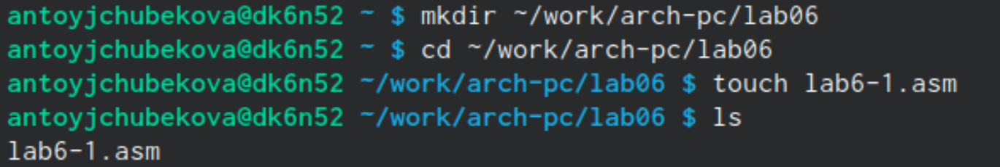{#fig:001 width=70%}

Перейдя в Midnight Commander с командой mc и спвользуя функциональную клавишу F5 скопируем в текущий каталог файл in_out.asm для ее дальнейшего применения. (РИС.2)

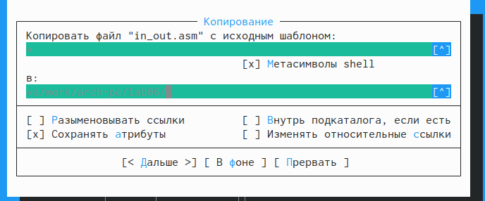{#fig:002 width=70%} 

Откроем созданный файл lab6-1.asm и напишем в него программу вывода значения регистра eax.(РИС 3)

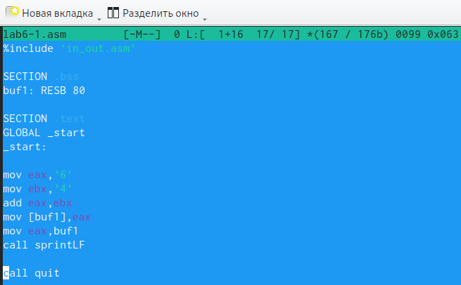{#fig:003 width=70%}

Создаем исполняемый файл и запускаем его.(РИС.4). Система выводит j, это происходит потому что программа вывела символ, соответствующий по системе ASCLL сумме "6(код символа равен 54)+4(код символа равен 52)", то есть число 106, что в свою очередь является кодом символа j.

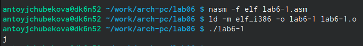{#fig:004 width=70%}

 Теперь изменим текст программы заменяя символы '6' и '4' на числа 6 и 4.(РИС.5)
 
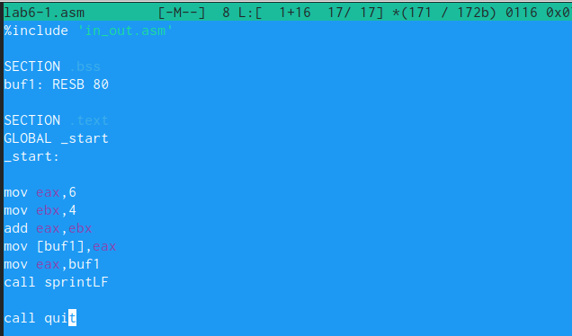{#fig:005 width=70%}
 
Создадим новый исполняемый файл программы и запустим его.(РИС.6).В кодировке ASCII символ Char 10 представлен шестнадцатеричным значением 0x0A или восьмеричным значением 012. На экран ничего не отоброжается

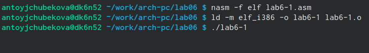{#fig:006 width=70%}

Создадим файл lab6-2.asm с помощью утилита touch в исходный каталог. С помощью ls видим, что файл был удачно создан

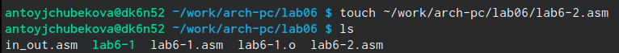{#fig:007 width=70%}

Введем в файл новую программу с использованием iprintLF для вывода значения регистра eax(РИС.8)

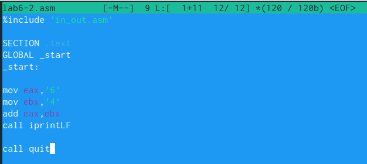{#fig:008 width=70%}

Создадим исполняемый файл и запускаем его.(РИС.9) Теперь на экран выводится число 106, в данном случае команда add складывает символы, но функция iprintLF позволяет вывести число, а не символ, кодом которого является это число.

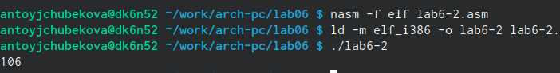{#fig:009 width=70%}

Аналогично предыдущему примеру изменим символы на числа, заменяя '6' и '4' на 6 и 4 в команде mov.(РИС.10)

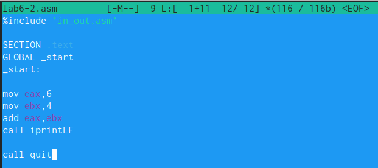{#fig:010 width=70%}

Создадим и запустим новый исполняемый файл(РИС.11). Программа складывает сами числа, а не соответствующие символам коды  в системе ASCLL и в итоге получаем число 10.

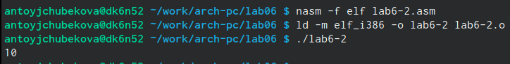{#fig:011 width=70%}

Заменим в исходной программе функцию iprintLF на функцию iprint.(РИС.12)

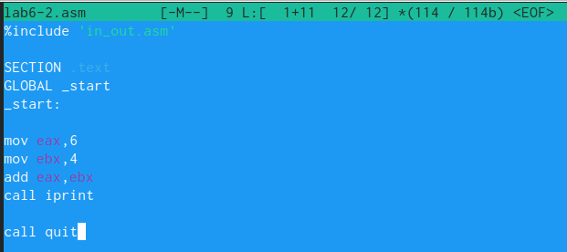{#fig:012 width=70%}

Создадим и запустим отредактированный файл(РИС.13). Мы видим,что программа выполнилась без перенова на новую строку. в этом и заключается разница между двумя функциями iprintLF-запрашивает перенос на новую строку, iprint- не запрашивает перенос на новую строку.

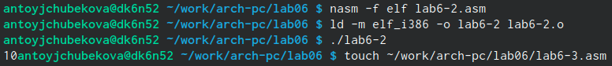{#fig:013 width=70%}

## Выполнение арифметических операций в NASM ##

Используя утилит touch создадим файл lab6-3.asm, в котором дальше будем работать.(РИС.14).Введя утилит ls видим, что файл удачно создан.

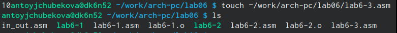{#fig:014 width=70%}

Внимательно изучив текст программы вычесления выражения F(x) = (5∗2 + 3)/3 запишем ее в файл lab6-3.asm.(РИС.15)

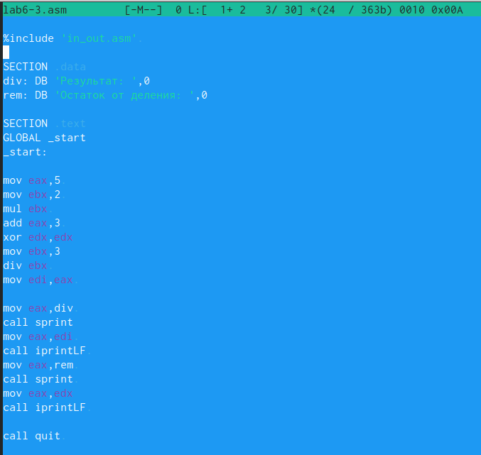{#fig:015 width=70%}

Создадим и запустим исполняемый файл(РИС.16). Можно заметить, что программа сработала и вывела на экран правильные значения.

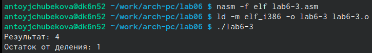{#fig:016 width=70%} 

Изменим текст программы так, чтобы она вычесляля выражение F(x)= (4*6 + 2)/5(РИС.17).

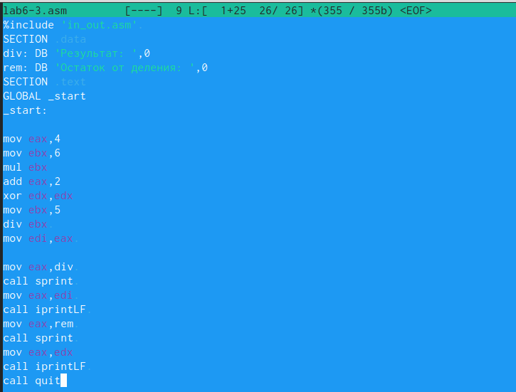{#fig:017 width=70%} 

Создадим и запустим исполняемый файл (РИС.18). Посчитав самостоятельно, мы видим, что программа работает правильно.

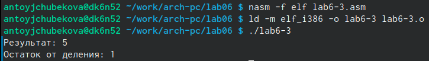{#fig:018 width=70%}

 Пользуясь утилитом touch создадим файл variant.asm.(РИС.19). Пользуясь командой ls видим, что файл создан.
 
 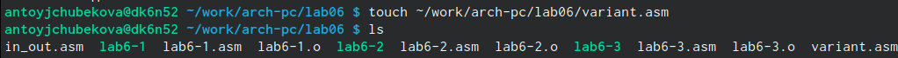{#fig:019 width=70%}
 
 Откроем этот файл с помощью функциональной клавиши F4 и запишем в него программу вычесления вычесления варианта задания по номеру студенческого билета.(РИС.20)
 
 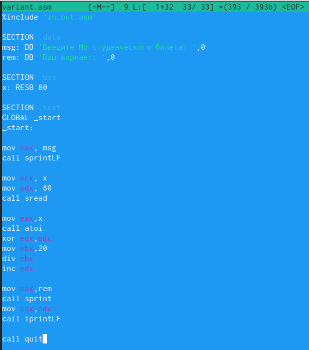{#fig:020 width=70%}
 
 Создадим и запустим исполняемый файл(РИС.21). Посчитав используя калькулятор, мы видим, что программа правильно выдает вариант.
 
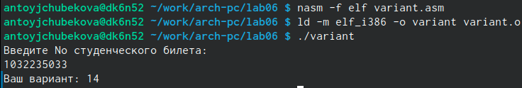{#fig:021 width=70%}
  
## Ответы на вопросы ##
1. За вывод сообщения "Ваш вариант" отвечает строки кода:\
mov eax, rem\
call sprint.
2. mov ecx, x - перемещает адрес вводимой строки x в регистр ecx\
mov edx, 80 - запись в регистр edx длину вводимой строки\
call sread - вызов подпрограммы из внешнего файла, обеспечивающий ввод сообщения с клавиатуры.
3. call atoi - используется для вызова подпрограммы из внешнего файла, которая преобразует ASII код символа в целое число и записывает результат в регист eax.
4. За вычисления варианта отвечают строки:\
xor edx,edx - обнуление edx для корректной работы div \
mov ebx,20 - ebx=20 \
div ebx - eax=eax/20, edx-остаток от деления\
inc edx - edx=edx+1.
5. При выполнении инструкции “div ebx” остаток от деления записывается в регистр edx.
6. Инструкция “inc edx” увеличивают значения регистра edx на 1.
7. За вывод на экран результата вычислений отвечают строки:\
mov eax, edx \
call iprintLF.

## Задание для самостоятельной работы ##

Создадим файл lab6-4.asm с помощью утилита touch.(РИС.22)

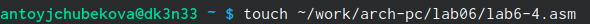{#fig:022 width=70%}

Откроем созданный файл и вводим в него текст программы, которая вычисляет значения выражения ( x/2 + 8)3, где x вводит пользователь - вариатн 14(РИС.23). Исходная программа выглядит следующим образом:

%include 'in_out.asm'\

SECTION .data\
msg: DB 'Введите x: ',0\
rem: DB 'Результат: ',0\

SECTION .bss\
x: RESB 80\

SECTION .text\
GLOBAL _start\
_start:\

mov eax, msg\
call sprintLF\

mov ecx, x\
mov edx, 80\
call sread\
mov eax, x\
call atoi\
xor edx,edx\
mov ebx,2\
div ebx\
add eax, 8\
mov ebx, 3\
mul ebx\
mov edi,eax\
mov eax,rem\
call sprint\
mov eax,edi\
call iprintLF\
call quit.

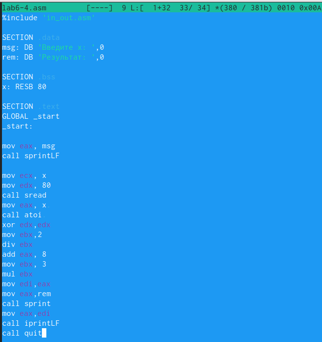{#fig:023 width=70%}

Создадим и запустим исполняемый файл(РИС.24). При вводе значения 1, выводится правильный ответ-24.

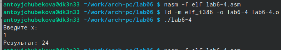{#fig:024 width=70%}

Проверим работу программы введя значения 4(РИС.25). Выводится правильный ответ-30

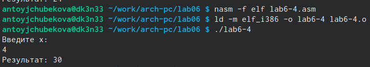{#fig:025 width=70%}

# Выводы

Выполняя лабораторную работу № 6 я освоила арифметические инструкции языка ассемблера NASM. Используя полученные навыки я написала программу, которая  вычисляет значения выражения ( x/2 + 8)3, где x вводит пользователь.

# Список литературы{.unnumbered}
-https://esystem.rudn.ru.
