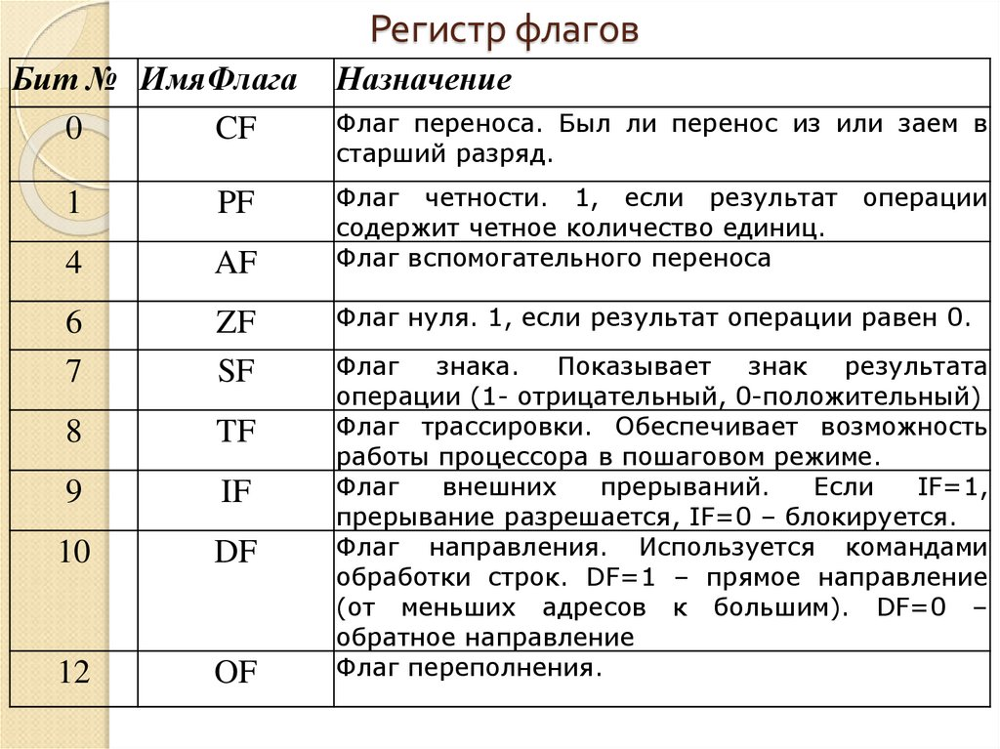
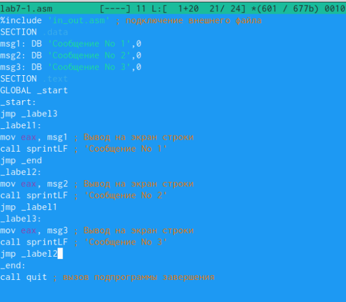

---
## Front matter
title: "Лабораторная работа № 7"
subtitle: "Архитектура компьютеров"
author: "Тойчубекова Асель Нурлановна"

## Generic otions
lang: ru-RU
toc-title: "Содержание"

## Bibliography
bibliography: bib/cite.bib
csl: pandoc/csl/gost-r-7-0-5-2008-numeric.csl

## Pdf output format
toc: true # Table of contents
toc-depth: 2
lof: true # List of figures
lot: true # List of tables
fontsize: 12pt
linestretch: 1.5
papersize: a4
documentclass: scrreprt
## I18n polyglossia
polyglossia-lang:
  name: russian
  options:
	- spelling=modern
	- babelshorthands=true
polyglossia-otherlangs:
  name: english
## I18n babel
babel-lang: russian
babel-otherlangs: english
## Fonts
mainfont: PT Serif
romanfont: PT Serif
sansfont: PT Sans
monofont: PT Mono
mainfontoptions: Ligatures=TeX
romanfontoptions: Ligatures=TeX
sansfontoptions: Ligatures=TeX,Scale=MatchLowercase
monofontoptions: Scale=MatchLowercase,Scale=0.9
## Biblatex
biblatex: true
biblio-style: "gost-numeric"
biblatexoptions:
  - parentracker=true
  - backend=biber
  - hyperref=auto
  - language=auto
  - autolang=other*
  - citestyle=gost-numeric
## Pandoc-crossref LaTeX customization
figureTitle: "Рис."
tableTitle: "Таблица"
listingTitle: "Листинг"
lofTitle: "Список иллюстраций"
lotTitle: "Список таблиц"
lolTitle: "Листинги"
## Misc options
indent: true
header-includes:
  - \usepackage{indentfirst}
  - \usepackage{float} # keep figures where there are in the text
  - \floatplacement{figure}{H} # keep figures where there are in the text
---

# Цель работы

Целью лабораторной работы №7 является изучение команд условного и безусловного переходов. А также приобретение навыков написания программ с использованием переходов. Знакомство с назначением и структурой файла листинга.

# Задание

- Понять работу команд управления или команды перехода: условный переход, безусловный переход;\
- Изучить работу регистра флагов: Carry Flag - Флаг переноса,  Parity Flag - Флаг чётности, Auxiliary Carry Flag -Вспомогательный флаг переноса, Zero Flag - Флаг нуля, Sign Flag - Флаг знака, Overflow Flag - Флаг переполнения;\
- Изучить работу инструкции cmp;\
- Рассмотреть файл листинга и его структуру;\
- Написать программу с использованием инструкции jmp опираясь на пример;\
- Написать программу, которая определяет и выводит на экран наибольшую из 3 целочисленных переменны:A,B,C опираясь на пример;\
-Задание для самостоятельной работы:
1. Напишите программу нахождения наименьшей из 3 целочисленных переменных a,b и . Значения переменных выбрать из табл. 7.5 в соответствии с вариантом, полученным при выполнении лабораторной работы № 7. Создайте исполняемый файл и проверьте его работу. 
2. Напишите программу, которая для введенных с клавиатуры значений x и a вычисляет значение заданной функции f(x) и выводит результат вычислений. Вид функции f(x) выбрать из таблицы 7.6 вариантов заданий в соответствии с вариантом, полученным при выполнении лабораторной работы № 7. Создайте исполняемый файл и проверьте его работу для значений x и a из 7.6.

# Теоретическое введение

Для реализации ветвлений в ассемблере используются так называемые команды передачи управления или команды перехода. Можно выделить 2 типа переходов:
-условный переход-выполняется или не выполняется переход в соответствии с условием;
-безусловный переход-выполняется переход в указанную точку программы.

## Команды безусловного перехода  ##

Безусловный переход выполняется инструкцией jmp, которая включает в себя адрес перехода, куда следует передать управление:\
jmp < адрес_перехода >

## Команды условного перехода  ##
В ассемблере команды условного перехода вычисляют условие перехода анализируя флаги из регистра флагов.
Регистр флагов – это очень важный регистр процессора, который используется при выполнении большинства команд. Регистр флагов носит название EFLAGS. Это 32-разрядный регистр. Однако старшие 16 разрядов используются при работе в защищённом режиме, и пока мы их рассматривать не будем. К младшим 16 разрядам этого регистра можно обращаться как к отдельному регистру с именем FLAGS. Именно этот регистр мы и рассмотрим в этом разделе.
Каждый бит в регистре FLAGS является флагом. Флаг – это один или несколько битов памяти, которые могут принимать двоичные значения (или комбинации значений) и характеризуют состояние какого-либо объекта. Обычно флаг может принимать одно из двух логических значений. Поскольку в нашем случае речь идёт о бите, то каждый флаг в регистре может принимать либо значение 0, либо значение 1. Флаги устанавливаются в 1 при определённых условиях, или установка флага в 1 изменяет поведение процессора. На РИС.1 показано, какие флаги находятся в разрядах регистра FLAGS.

{#fig:001 width=70%}

## Инструкция cmp ##

Инструкции cmp позволяет сравнить операнды и выставляет флаги в зависимости от результата сравнения:\
cmp < операнд_1 >,< операнд_2 >\
Эта инструкция никуда не записывает результат и единственным результатом команды сравнения является формирование флагов.

## Описание команд условного перехода ##

Команда условного перехода имеет вид:\
j< мнемоника перехода > label\
Мнемоника перехода связана со значением анализируемых флагов или со способом фор-
мирования этих флагов.
На РИС.2 представлены команды условного перехода, которык обычно ставятся после команды сравнения cmp.

{#fig:002 width=70%}

## Файл листинга и его структура ##

Листинг — это один из выходных файлов, создаваемых транслятором. Он имеет текстовый вид и нужен при отладке программы, так как кроме строк самой программы он содержит дополнительную информацию. Все ошибки и предупреждения, обнаруженные при ассемблировании, транслятор выводит на экран, и файл листинга не создаётся.
Итак, структура листинга:\
- номер строки — это номер строки файла листинга (нужно помнить, что номер строки в файле листинга может не соответствовать номеру строки в файле с исходным текстом программы);\
- адрес — это смещение машинного кода от начала текущего сегмента;\
- машинный код представляет собой ассемблированную исходную строку в виде шестна дцатеричной последовательности. (например, инструкция int 80h начинается по смещению 00000020 в сегменте кода; далее идёт машинный код, в который ассемблируется инструкция, то есть инструкция int 80h ассемблируется в CD80 (в шестнадцатеричном представлении); CD80 — это инструкция на машинном языке, вызывающая прерывание ядра);\
- исходный текст программы — это просто строка исходной программы вместе с комментариями (некоторые строки на языке ассемблера, например, строки, содержащие только комментарии, не генерируют никакого машинного кода, и поля «смещение» и «исходный текст программы» в таких строках отсутствуют, однако номер строки имприсваивается).

# Выполнение лабораторной работы

Создадим каталог для программ лабораторной работы №7, затем перейдем в него и создадим в нем файл lab7-1.asm, с которым будем работать. Введя команду ls удостоверимся что файл был создан.(РИС.3)

{#fig:003 width=70%}

Далее введем текст программы, в котором используется инструкция jmp в файл lab7-1.asm (РИС.4)

{#fig:004 width=70%}

Создадим исполняемый файл и запустим его. Видим что исполняемая инструкция jmp _label2 поменяла порядок исполнения инструкций и позволила(перепрыгнула) начать выполнение инструкции с меткой _label2, пропустив вывод первого сообщения.(РИС.5)

{#fig:005 width=70%}

Изменим текст  программы так, чтобы на выводила сначала ‘Сообщение No 2’, потом ‘Сообщение № 1’ и завершала работу.(РИС.6)

  {#fig:006 width=70%}\
  
Создадим исполняемый файл и запустим его. Мы видим, что все правильно работает.(РИС.7)

{#fig:007 width=70%}

Изменим текст программы так, чтобы сообщения выводились в попядке убывания, Сообщение№3->Сообщение№2->Сообщение№3.(РИС.8)

{#fig:008 width=70%}

Создадим исплняемый файл и запустим его. Видим, что все правильно выводится.(РИС.9)

{#fig:009 width=70%}

Созадим файл lab7-2.asm в исходном катаоге, далее напишем в него текст программы, которая определяет и выводит на экран наибольшую из 3 целочисленных переменных:A,B,C.(РИС.10)

{#fig:0010 width=70%}

Создадим исполняемый файл и запусимего. Проверяем его работу на числах 1 и 60 и видим, что все правельно работает.(РИС.11) и (РИС.11_1)

{#fig:011 width=70%}

{#fig:012 width=70%}

Создайте файл листинга для программы из файла lab7-2.asm, введя команду: nasm -f elf -l lab7-2.lst lab7-2.asm.(РИС.12)

{#fig:013 width=70%}

Открое файл листинга lab7-2.lst с помощью текстового редактора mcedit и внимательно изучим его формат и содержание.(РИС.13)

{#fig:014 width=70%}

Подробно объясним содержание предствленных трех строчках на РИС.14 

{#fig:015 width=70%}

строка 196 \
- 21 - номер строки в подпрограмме\
- 00000101 - адрес\
-  B8 [0A000000] - машинный код\
- mov ecx,B - код программы - копирует B в ecx.

строка 197 \
- 22 - номер строки в подпрограмме\
- 00000106 - адрес\
- E891FFFFFF - машинный код.

строка 198 \
- 23 - номер строки в подпрограмме\
- 0000010B - адрес\
- A3[0A000000] - машинный код.

Открыл файл с программой lab7-2.asm и в инструкции с двумя операндами удалиv один операнд. Выполнил трансляцию с получением файла листинга.(РИС.15) и (РИС.15_1)

{#fig:016 width=70%}

{#fig:017 width=70%}

Объектный файл не смог создаться из-за ошибки. Но получился листинг, где выделено место ошибки.

## Задание для самостоятельной работы ##

Создадим файл lab7-3.asm в котором будем работать.(РИС.16)
Напишем программу нахождения наименьшей из 3 целочисленных переменных a,b и c. Значения переменных-81,22,72.(РИС.17) Сама программа выглядит следующим образом:\

%include 'in_out.asm'\

section .data\
msg1 db "Наибольшее число: ",0h\
A dd '81'\
B dd '22'\
C dd '72'\

section .bss\
min resb 10\

section .text\
global _start\
_start:\

mov eax,B\
call atoi\
mov[B],eax\

mov ecx,[A]\ 
mov [min],ecx\
cmp ecx,[C]\
jl check_B\
mov ecx,[C]  mov [min],ecx\

check_B:\
mov eax,min\
call atoi\
mov [min],eax\

mov ecx,[min]\
cmp ecx,[B]  jl fin\ 
mov ecx,[B]  mov [min],ecx\

fin:\
mov eax, msg1\
call sprint\
mov eax,[min]\

call iprintLF\ 
call quit\

{#fig:018 width=70%}

{#fig:019 width=70%}

Создадим исполняемый файл и запустим его. Видим, что правильно работает и программа выдает число 22.(РИС.18)

{#fig:020 width=70%}

Создадим файл lab7-4.asm в котором будем работать.(РИС.19)
Напишем программу, которая для введенных с клавиатуры значений x и a вычисляет
значение заданной функции, указанная в вариане 14, в соответствии с условиями и выводит результат вычислений.(РИС.20). Сама программа вынлядит следующим образом:\

%include 'in_out.asm'\

section .data\
msg DB 'Введите x: ',0h\
msg1 DB "Введите a: ",0h\
msg2: DB 'Ответ:',0h\

section .bss\
x: RESB 10\
a: RESB 10\
otv: RESB 10\

section .text\
global _start\
_start:\

mov eax,msg\
call sprint\

mov ecx,x\
mov edx,10\
call sread\

mov eax,x\
call atoi\
mov [x],eax\

mov eax,msg1\
call sprint\

mov ecx,a\
mov edx,10\
call sread\

mov eax,a\
call atoi\
mov [a],eax\

mov ebx,3\

mov ecx,[x]\
cmp ecx,[a]\
jl inache\
mov eax, [x]\
mul ebx\
inc eax\
jmp chan\

inache:\
mov eax,[a]\
mul ebx\
inc eax\

chan:\
mov [otv],eax\

fin:\
mov eax,msg2\
call sprint\

mov eax,[otv]\
call iprintLF\

call quit.

{#fig:021 width=70%}

{#fig:022 width=70%}

Создадим исполняемый файл и запустим его. Поститав с кальткулятором видим что все правильно работает.(РИС.21) и (РИС.22)

{#fig:023 width=70%}

{#fig:024 width=70%}

# Выводы

В ходя выполнения лабораторной работы №7 я научилась пользоваться командами условного и безусловного переходов. Также приобрела некоторые навыки написания программ и использованием переходов. Еще познакомилась с назначением и структурой файла листинга. Далее используя полученные навыки, я написала программу находящая наименьшую из трех целочисленных переменных (81,22,72). Вместе с тем написала программу которая для введенных с клавиатуры значений x,a вычисляет значения  функций удовлетворяющее условию и выводит результат.

# Список литературы{.unnumbered}

-https://esystem.rudn.ru/course/view.phpid=4975
