---
## Front matter
title: "Лабораторная работа №8"
subtitle: "Архитектура компьютеров"
author: "Тойчубекова Асель Нурлановна"

## Generic otions
lang: ru-RU
toc-title: "Содержание"

## Bibliography
bibliography: bib/cite.bib
csl: pandoc/csl/gost-r-7-0-5-2008-numeric.csl

## Pdf output format
toc: true # Table of contents
toc-depth: 2
lof: true # List of figures
lot: true # List of tables
fontsize: 12pt
linestretch: 1.5
papersize: a4
documentclass: scrreprt
## I18n polyglossia
polyglossia-lang:
  name: russian
  options:
	- spelling=modern
	- babelshorthands=true
polyglossia-otherlangs:
  name: english
## I18n babel
babel-lang: russian
babel-otherlangs: english
## Fonts
mainfont: PT Serif
romanfont: PT Serif
sansfont: PT Sans
monofont: PT Mono
mainfontoptions: Ligatures=TeX
romanfontoptions: Ligatures=TeX
sansfontoptions: Ligatures=TeX,Scale=MatchLowercase
monofontoptions: Scale=MatchLowercase,Scale=0.9
## Biblatex
biblatex: true
biblio-style: "gost-numeric"
biblatexoptions:
  - parentracker=true
  - backend=biber
  - hyperref=auto
  - language=auto
  - autolang=other*
  - citestyle=gost-numeric
## Pandoc-crossref LaTeX customization
figureTitle: "Рис."
tableTitle: "Таблица"
listingTitle: "Листинг"
lofTitle: "Список иллюстраций"
lotTitle: "Список таблиц"
lolTitle: "Листинги"
## Misc options
indent: true
header-includes:
  - \usepackage{indentfirst}
  - \usepackage{float} # keep figures where there are in the text
  - \floatplacement{figure}{H} # keep figures where there are in the text
---

# Цель работы

Целью данной лабораторной работы является приобретение навыков написания программ с использованием циклов и обработкой аргументов командной строки.

# Задание

 1. Изучить теоретическое введение:\
- Организация стека;\
- Добавление элемента в стек;\
- Извлечение элемента из стека;\
- Инструкции организации циклов.
2. Изучив реализацию циклов в NASM, написать программу вывода значений регистра ecx.
3. Изучив обработку аргументов командной строки, написать программу выводящую на экран аргументы командной строки.
4. Написать программу вычисляющую суммы и произведений аргументов командной строки.
5. Выполнить задание для самостоятельной работы:\
  Напишите программу, которая находит сумму значений функции F(x) для
x = x1, x2, ..., xn, т.е. программа должна выводить значение F(x1) + f(x2) + ... + f(xn).
Значения xi передаются как аргументы. Вид функции f(x) выбрать из таблицы 8.1 вариантов заданий в соответствии с вариантом, полученным при выполнении лабораторной работы No 7. Создайте исполняемый файл и проверьте его работу на нескольких наборах x = x1, x2, ...,xn

# Теоретическое введение

## Организация стека ##

Основной функцией стека является функция сохранения адресов возврата и передачи
аргументов при вызове процедур. Кроме того, в нём выделяется память для локальных
переменных и могут временно храниться значения регистров. Для стека существует две основные операции:push- добавление элементов в вершину стека; pop-извлечение элемента из вершины стека.

## Добавление элемента в стек ##

Команда push размещает значение в стеке, т.е. помещает значение в ячейку памяти, на
которую указывает регистр esp, после этого значение регистра esp увеличивается на 4.
Данная команда имеет один операнд — значение, которое необходимо поместить в стек.

## Извлечение элемента из стека ##

Команда pop извлекает значение из стека, т.е. извлекает значение из ячейки памяти, на
которую указывает регистр esp, после этого уменьшает значение регистра esp на 4. У этой
команды также один операнд, который может быть регистром или переменной в памяти.
Нужно помнить, что извлечённый из стека элемент не стирается из памяти и остаётся как
“мусор”, который будет перезаписан при записи нового значения в стек

## Инструкции организации циклов ##

Для организации циклов существуют специальные инструкции. Для всех инструкций
максимальное количество проходов задаётся в регистре ecx. Наиболее простой является ин-
струкция loop. Она позволяет организовать безусловный цикл, типичная структура. Иструкция loop выполняется в два этапа. Сначала из регистра ecx вычитается единица и его значение сравнивается с нулём. Если регистр не равен нулю, то выполняется переход куказанной метке. Иначе переход не выполняется и управление передаётся команде, которая следует сразу после команды loop.

# Выполнение лабораторной работы

Для начала создадим каталог для программ лабораторной работы №8. Перейдя в каталог создадим файл lab8-1.asm.(РИС.1)

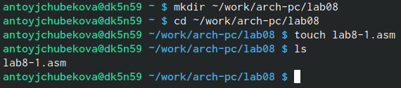{#fig:001 width=70%}

Напишем в файл lab8-1.asm программу вывода значений регистра eax, перед этим внимательно изучив ее.(РИС.2)

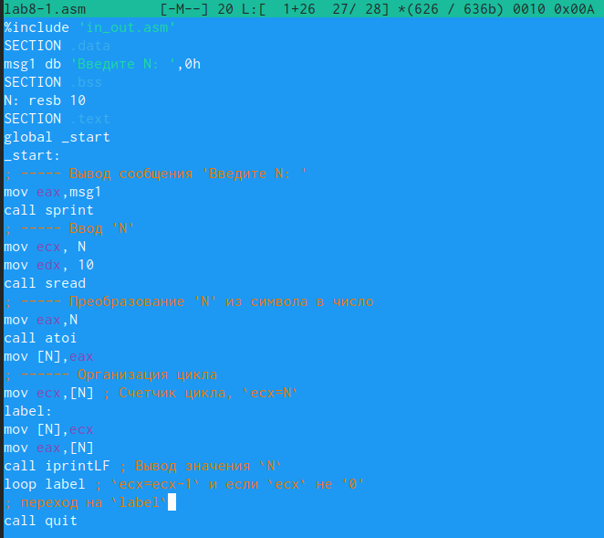{#fig:002 width=70%}

Создадим исполняемый файл и запустим его. Мы видим, что программа выводит значения от N до 1.(РИС.3) Данный пример показывает, что использование регистра ecx в теле цилка loop может привести к некорректной работе программы

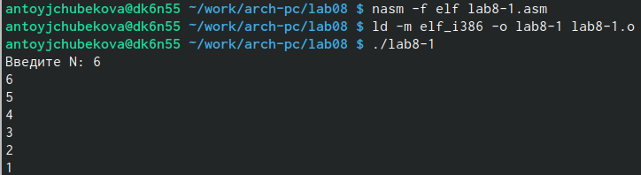{#fig:003 width=70%}

Чтобы исправить некорректную работу программы внесем изменения в текст программы добавив изменение значение регистра ecx в цикле.(РИС.4)

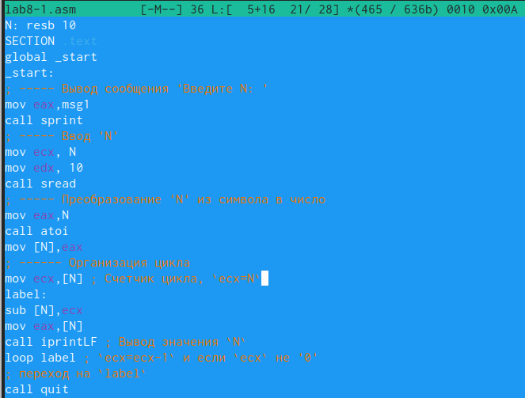{#fig:004 width=70%}

Создадим исполняемый файл и запустим его. Мы видим, что программа запускает бесконечный цикл при нечетном значении N (РИС.5) и выводит только нечетные числа при четном значении N.(РИС.5_1)

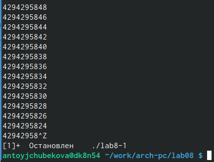{#fig:005 width=70%}

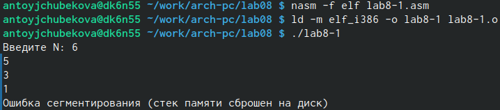{#fig:006 width=70%}

Для корректной работы программы внесем изменения в текст программы добавив push и pop для сохранения значения счетчика цикла loop.(РИС.6)

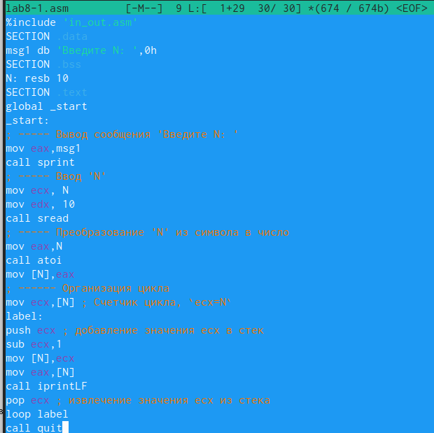{#fig:007 width=70%}

Создадим исполняемый файл и запустим его. Мы видим, что программа выводит числа от N-1 до 1, где количество проходов цикла соответствует значению N.(РИС.7)

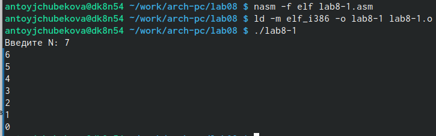{#fig:008 width=70%}

Создадим файл lab8-2.asm.(РИС.8) Внимательно изучив, запишем в этот файл программу выводящую на экран аргументы командной строки.(РИС.9)

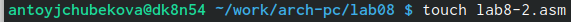{#fig:009 width=70%}

{#fig:010 width=70%}

Создадим исполняемый файл и запустим его. Программа обработала 4 агрумента, так как аргумент 2 не был взят в кавычки, в отличии от агрумента 3, поэтому из за пробела программа берет 2 как отдельный аргумент.(РИС.10)

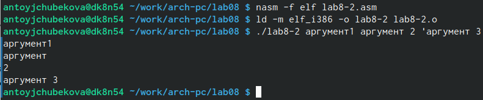{#fig:011 width=70%}
 
Создадим файл lab8-3.asm.(РИС.11) Внимательно изучив, запишем в него программу вычесления суммы аргументов командной строки.(РИС.11)

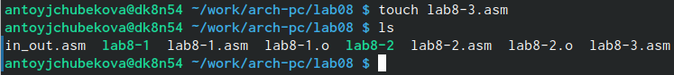{#fig:012 width=70%}

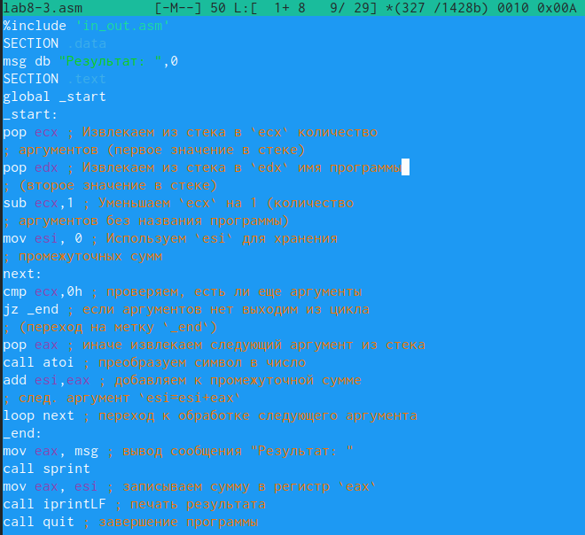{#fig:013 width=70%}

Создадим исполняемый файл и запустим его. Проверим работу программы на значениях (12 13 7 10 5) и на значениях(7 4 6 9 10).Мы видим, что все работает правильно.(РИС.12)

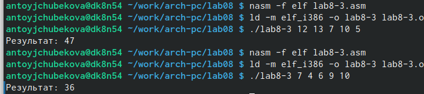{#fig:014 width=70%}

Изменим текст программы так, чтобы программа вычисляля произведения аргументов командной строки(РИС.13) Сама программа выглядит следующим образом:\

%include 'in_out.asm'\
SECTION .data\
msg db "Результат: ",0\
SECTION .text\
global _start\
_start:\
pop ecx ; Извлекаем из стека в `ecx` количество\
; аргументов (первое значение в стеке)\
pop edx ; Извлекаем из стека в `edx` имя программы\
; (второе значение в стеке)\
sub ecx,1 ; Уменьшаем `ecx` на 1 (количество\
; аргументов без названия программы)\
mov esi, 1 ; Используем `esi` для хранения\
; промежуточных сумм \
next:\
cmp ecx,0h ; проверяем, есть ли еще аргументы\
jz _end ; если аргументов нет выходим из цикла\
; (переход на метку `_end`)\
pop eax ; иначе извлекаем следующий аргумент из стека\
call atoi ; преобразуем символ в число\
mul esi \
mov esi,eax\
loop next ; переход к обработке следующего аргумента\
_end:
mov eax, msg ; вывод сообщения "Результат: "\
call sprint
mov eax, esi ; записываем сумму в регистр `eax`\
call iprintLF ; печать результата\
call quit.

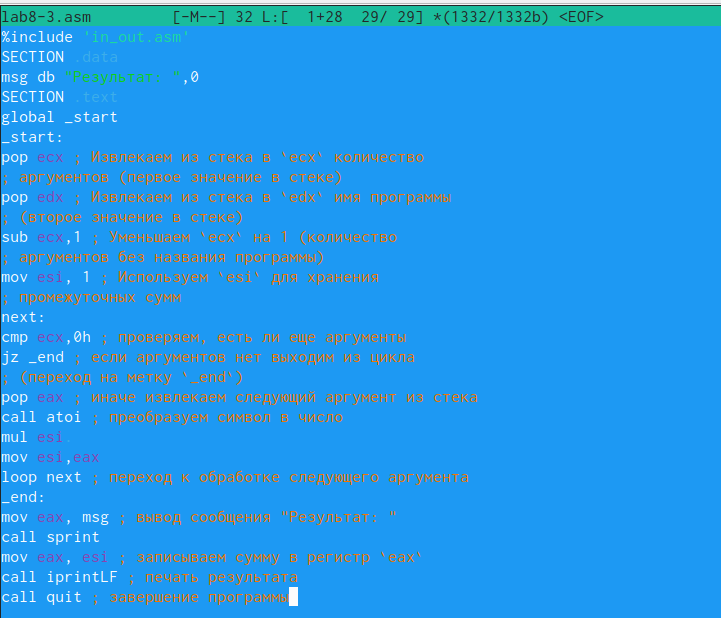{#fig:015 width=70%}

Создадим исполняемый файл и запустим его. Проверим работу программы на значениях (1 2 3 4 5). Мы видим, что все правильно работает(РИС.14)

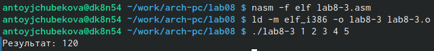{#fig:016 width=70%}

## Задание для самостоятельной работы ##

Напишем программу которая находит сумму значений функции f(x)=7(x+1)(вариант 14) для x=x1,x2,...xn,то есть программа должна выводиь F(x1) + f(x2) + ... + f(xn)(РИС.15)
Сама программа выглядит следующим обрпзом:\

%include 'in_out.asm'\

SECTION .data\
msg db "Результат: ",0\

SECTION .text\
global _start\
_start:\

pop ecx \

pop edx \

sub ecx,1\ 

mov esi, 0\

next:\
cmp ecx,0h \
jz _end \

pop eax \
call atoi\ 
inc eax\
mov ebx,7 \
mul ebx\
add esi,eax\
loop next \
_end:\

mov eax, msg\
call sprint\
mov eax, esi\ 
call iprintLF\ 
call quit \

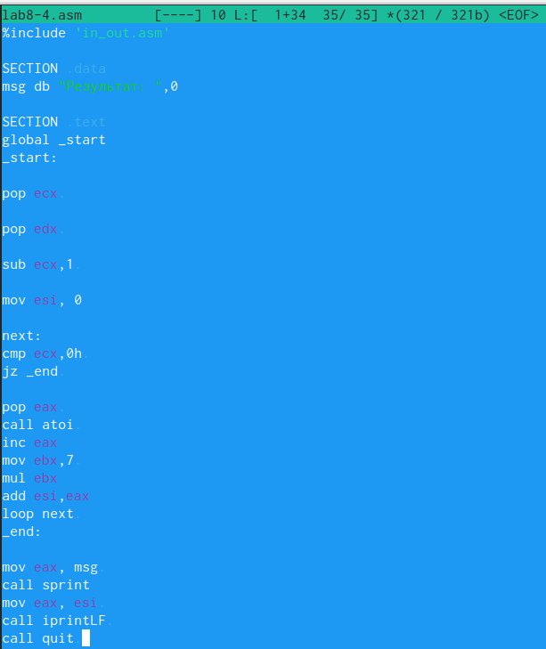{#fig:017 width=70%}

Создадим исполняемый файл и запустим его. Проверим корректность работы программы введя значения (1 2 3);(6 7 8);(4 3). Используя какулятор и проверив правильный ответ мы видим, что программа работает правильно.(РИС.16)

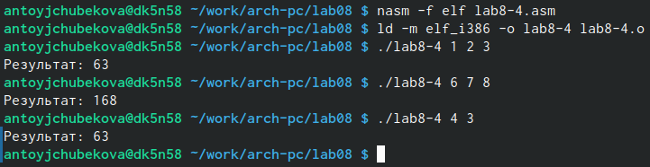{#fig:018 width=70%}

# Выводы

В ходе выполнения лабораторной работы №8 я приобрела навыки написания программ с использованием циклов и обработкой аргументов командной строки. Применяя полученные навыки написала программу, которая наодит значение сумму значений функции f(x) для различных x.

# Список литературы{.unnumbered}

-https://esystem.rudn.ru/course/view.php?id=4975.
