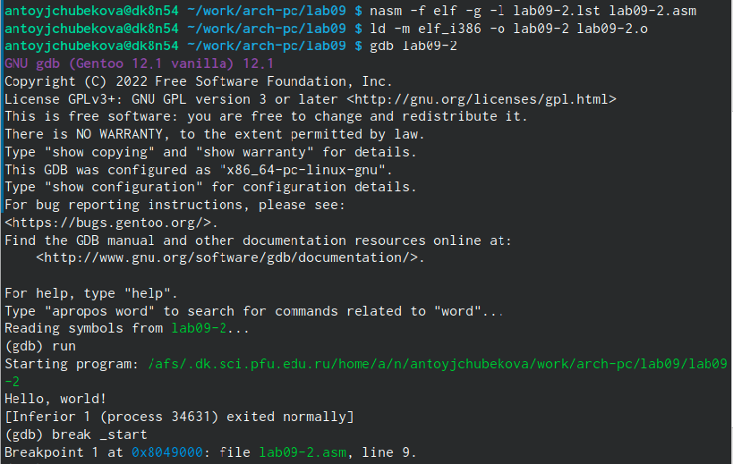

---
## Front matter
title: "Лабораторная работа №9"
subtitle: "Архитектура компьютера"
author: "Тойчубекова Асель Нурлановна"

## Generic otions
lang: ru-RU
toc-title: "Содержание"

## Bibliography
bibliography: bib/cite.bib
csl: pandoc/csl/gost-r-7-0-5-2008-numeric.csl

## Pdf output format
toc: true # Table of contents
toc-depth: 2
lof: true # List of figures
lot: true # List of tables
fontsize: 12pt
linestretch: 1.5
papersize: a4
documentclass: scrreprt
## I18n polyglossia
polyglossia-lang:
  name: russian
  options:
	- spelling=modern
	- babelshorthands=true
polyglossia-otherlangs:
  name: english
## I18n babel
babel-lang: russian
babel-otherlangs: english
## Fonts
mainfont: PT Serif
romanfont: PT Serif
sansfont: PT Sans
monofont: PT Mono
mainfontoptions: Ligatures=TeX
romanfontoptions: Ligatures=TeX
sansfontoptions: Ligatures=TeX,Scale=MatchLowercase
monofontoptions: Scale=MatchLowercase,Scale=0.9
## Biblatex
biblatex: true
biblio-style: "gost-numeric"
biblatexoptions:
  - parentracker=true
  - backend=biber
  - hyperref=auto
  - language=auto
  - autolang=other*
  - citestyle=gost-numeric
## Pandoc-crossref LaTeX customization
figureTitle: "Рис."
tableTitle: "Таблица"
listingTitle: "Листинг"
lofTitle: "Список иллюстраций"
lotTitle: "Список таблиц"
lolTitle: "Листинги"
## Misc options
indent: true
header-includes:
  - \usepackage{indentfirst}
  - \usepackage{float} # keep figures where there are in the text
  - \floatplacement{figure}{H} # keep figures where there are in the text
---

# Цель работы

Целью лабораторной работы №9 является приобретение навыков написания программ с использованием подпрограмм, также знакомство с методами отладки при помощи GDB и его основными возможностями.
# Задание
1. Изучить теоретическое введение:\
- Понятие откладки\
- Методы откладуи\
- Основные возможности откладчика GDB\
- Запуск откладчика GDB;\
- Дизассемблирование программы;\
- Точки останова;\
- Пошаговая откладка;\
- Работа с данными программы в GDB;\
- Понятие подпрограммы;\
- Инструкция call и инструкция ret;\
2. Написать программу с использованием вызова подпрограммы\
3. Выполнить откладку программы с помощью GDB\
4. Выполнить обработку аргументов командной строки в GDB\
5. Задание для самостоятельной работы:\
- Преобразуйте программу из лабораторной работы No8 (Задание No1 для самостоятель-
ной работы), реализовав вычисление значения функции f(x) как подпрограмму.\
- В листинге 9.3 приведена программа вычисления выражения (3 + 2)*4 + 5. При запуске
данная программа дает неверный результат. Проверьте это. С помощью отладчика GDB,
анализируя изменения значений регистров, определите ошибку и исправьте ее.

# Теоретическое введение

## Понятие об отладке ##

Отладка — это процесс поиска и исправления ошибок в программе. В общем случае его
можно разделить на четыре этапа:\
• обнаружение ошибки;\
• поиск её местонахождения;\
• определение причины ошибки;\
• исправление ошибки.\
Можно выделить следующие типы ошибок:\
• синтаксические ошибки — обнаруживаются во время трансляции исходного кода и
вызваны нарушением ожидаемой формы или структуры языка;\
• семантические ошибки — являются логическими и приводят к тому, что программа
запускается, отрабатывает, но не даёт желаемого результата;\
• ошибки в процессе выполнения — не обнаруживаются при трансляции и вызывают пре-
рывание выполнения программы (например, это ошибки, связанные с переполнением
или делением на ноль).

## Методы откладки ##

Наиболее часто применяют следующие методы отладки:
• создание точек контроля значений на входе и выходе участка программы (например,
вывод промежуточных значений на экран — так называемые диагностические сообще-
ния);\
• использование специальных программ-отладчиков.

## Основные возможности отладчика GDB ##

GDB (GNU Debugger — отладчик проекта GNU) [1] работает на многих UNIX-подобных
системах и умеет производить отладку многих языков программирования. GDB предлагает
обширные средства для слежения и контроля за выполнением компьютерных программ. От-
ладчик не содержит собственного графического пользовательского интерфейса и использует
стандартный текстовый интерфейс консоли. Однако для GDB существует несколько сторон-
них графических надстроек, а кроме того, некоторые интегрированные среды разработки
используют его в качестве базовой подсистемы отладки.
GDB может выполнять следующие действия:\
• начать выполнение программы, задав всё, что может повлиять на её поведение;\
• остановить программу при указанных условиях;\
• исследовать, что случилось, когда программа остановилась;\
• изменить программу так, чтобы можно было поэкспериментировать с устранением эффектов одной ошибки и продолжить выявление других.

## Запуск отладчика GDB; выполнение программы; выход ##

Синтаксис команды для запуска отладчика имеет следующий вид:\
gdb опции имя файла|ID процесса\
После запуска gdb выводит текстовое сообщение — так называемое «nice GDB logo». В
следующей строке появляется приглашение (gdb) для ввода команд.

Далее приведён список некоторых команд GDB.

Команда run (сокращённо r) — запускает отлаживаемую программу в оболочке GDB.

Если точки останова были заданы, то отладчик останавливается на соответствующей
команде и выдаёт номер точки останова, адрес и дополнительную информацию — текущую
строку, имя процедуры, и др.

Команда kill (сокращённо k) прекращает отладку программы, после чего следует вопрос
о прекращении процесса отладки:\
Kill the program being debugged? (y or n) y\

Если в ответ введено y (то есть «да»), отладка программы прекращается. Командой
run её можно начать заново, при этом все точки останова (breakpoints), точки просмотра
(watchpoints) и точки отлова (catchpoints) сохраняются.
Для выхода из отладчика используется команда quit (или сокращённо q)

## Дизассемблирование программы ##

Если есть файл с исходным текстом программы, а в исполняемый файл включена информация о номерах строк исходного кода, то программу можно отлаживать, работая в отладчике непосредственно с её исходным текстом. Чтобы программу можно было отлаживать на уровне строк исходного кода, она должна быть откомпилирована с ключом -g. Посмотреть дизассемблированный код программы можно с помощью команды disassemble <метка/адрес>:\
(gdb) disassemble _start.\
Существует два режима отображения синтаксиса машинных команд: режим Intel, используемый в том числе в NASM, и режим ATT (значительно отличающийся внешне). По умолчанию в дизассемблере GDB принят режим ATT. Переключиться на отображение команд с привычным Intel’овским синтаксисом можно, введя команду set disassembly-flavor intel.

## Точки останова ##

Установить точку останова можно командой break (кратко b). Типичный аргумент этой команды — место установки. Его можно задать как имя метки или как адрес. Чтобы не было
путаницы с номерами, перед адресом ставится «звёздочка».

Информацию о всех установленных точках останова можно вывести командой info breakpoint.

Для того чтобы сделать неактивной какую-нибудь ненужную точку останова, можно воспользоваться командой disable, а активировать командой enable.

Если же точка останова в дальнейшем больше не нужна, она может быть удалена с помощью
команды delete.

## Пошаговая отладка ##

Для продолжения остановленной программы используется команда continue (c) (gdb) с аргумент. Выполнение программы будет происходить до следующей точки останова. В качестве аргумента может использоваться целое число N, которое указывает отладчику проигнорировать N− 1 точку останова (выполнение остановится на N-й точке). Команда stepi (кратко sI) позволяет выполнять программу по шагам, т.е. данная команда выполняет ровно одну инструкцию.

## Работа с данными программы в GDB ##

Отладчик может показывать содержимое ячеек памяти и регистров, а при необходимости позволяет вручную изменять значения регистров и переменных. 
Посмотреть содержимое регистров можно с помощью команды info registers.
Для отображения содержимого памяти можно использовать команду x/NFU <адрес>, выдаёт содержимое ячейки памяти по указанному адресу. NFU задает формат, в котором выводятся
данные.

## Понятие подпрограммы ##

Подпрограмма — это, как правило, функционально законченный участок кода, который
можно многократно вызывать из разных мест программы. В отличие от простых переходов
из подпрограмм существует возврат на команду, следующую за вызовом.

## Инструкция call и инструкция ret ##

Для вызова подпрограммы из основной программы используется инструкция call, кото-
рая заносит адрес следующей инструкции в стек и загружает в регистр eip адрес соответствующей подпрограммы, осуществляя таким образом переход. 
Подпрограмма завершается инструкцией ret, которая извлекает из стека адрес, занесённый туда соответствующей инструкцией call, и заносит его в eip. Подпрограмма может вызываться как из внешнего файла, так и быть частью основной программы.

# Выполнение лабораторной работы

Создадим каталог для выполнения лабораторной работы №9, перейдем в него и создадим файл lab09-1.asm.(РИС.1)

{#fig:001 width=70%}

Введем в файл lab09-1.asm текст программы с использованием вызова подпрограммы.(РИС.2)

{#fig:002 width=70%}

Создадим исполняемый файл и запустим его. Мы видим, что программа правильно работает и выдает правильно значение.(РИС.3)

{#fig:003 width=70%}

Изменим текст программы, добавив подпрограмму _subcalcul в подпрограмму _calcul, для вычисления выражения f(g(x)), где x вводится с клавиатуры, f(x) = 2x + 7, g(x)=3x − 1.(РИС.4)

{#fig:004 width=70%}

Создадим исполняемый файл и запустим его. Проверим работу программы введя число 2 и видим, что все работает правильно.(РИС.5)

{#fig:005 width=70%}

Создадим файл lab09-2.asm и введем в него текст программы вывода сообщения Hello world!(РИС.6)

{#fig:006 width=70%}

Создадим исполняемый файл для работы с GDB с посощью команд:\
nasm -f elf -g -l lab09-2.lst lab09-2.asm\
ld -m elf_i386 -o lab09-2 lab09-2.o\
Запустим исполняемый файл в отладчик gdb.(РИС.7)

{#fig:007 width=70%}

Проверим работу программы, запустив ее в оболоче GDB с помощью команды run(РИС.8)

{#fig:008 width=70%}

Для более подробного анализа программы установим breakpoint  на метку _start и запустим ее.(РИС.9)

{#fig:009 width=70%}

Просмотрим дисассимилированный код программы с помощью команды disassemble начиная с метки _start. Далее переключимся на отображение команд с Intel’овским синтаксисом, введя команду set disassembly-flavor intel(РИС.10)

{#fig:010 width=70%}

В пежимк ATT имена регистров начинаются с символа %, а имена опрерандов с $, в то время как в intel используется привычный нам синтаксис.

Включим режим перфографики для более удобного анализа программы.(РИС.11)

{#fig:011 width=70%}

Проверим установленный breakpoint по имени метки _start c помощью команды info breakpoints.(РИС.12)

{#fig:012 width=70%}

Установим еще одну точку основа по адресу инструкции mov ebx,0x0. Просмотрим информацию о всех установленных точках останова введя i b.(РИС.13)

{#fig:013 width=70%}

Выполним 5 инструкций с помощью команды stepi и наблюдаем за изменением значений регистров.(РИС.14) Мы видим, что изменились значение регистров eax,ecx,edx,ebx(РИС.15)

{#fig:014 width=70%}

{#fig:015 width=70%}

Просмотрим значение переменной msg1 по имени используя команду x/1sb &msg1, также просмотрим значение переменной msg2 по ее адресу.(РИС.16)

{#fig:016 width=70%}

Используя команду set изменим второй символ переменной msg1 на h.(РИС.17)

{#fig:017 width=70%}

Заменим первый символ в переменной msg2 на f(РИС.18)

{#fig:018 width=70%} 

Выведим значение регистра edx в шестнадцатиричном, двоичном формах и символьном виде.(РИС.19)

{#fig:019 width=70%}

С помощью команды set изменим значение регистра ebx в соответствии с заданием.(РИС.20)

{#fig:020 width=70%}

Разница вывода команд p/s $ebx отличается тем, что в первом случае мы переводим символ в его строковой вид, а во втором случае число в строковом виде не изменяется.

Завершим выполнение программы с помощью команды countinue и выйдем из GDB с помощью команды quit.(РИС.21)

{#fig:021 width=70%}

Скопируем файл lab8-2.asm, созданный при выполнении лабораторной работы № 8 в файл с именем lab09-3.asm.(РИС.22)

{#fig:022 width=70%}

Создадим исполняемый файл.(РИС.23)

{#fig:023 width=70%}

Загрузим исполняемый файл в отладчик gdb, указав аргументы с использованием ключа --args(РИС.24)

{#fig:024 width=70%}

Установим точку останова перед первой инструкцией в программе и запустим ее.(РИС.25)

{#fig:025 width=70%}

Просмотрим вершину стека и остальные позиции стека по их адресам.Шаг изменения адреса равна 4, потому что количество аргументов командной строки равно 4.(РИС.26)

{#fig:026 width=70%}

## Задание для самостоятельной работы ##

Скопиров в файл lab08-4.asm в новый файл lab09-4.asm преобразуем программу в этлм файле так, чтобы вычесление значения функции реализовывалась как подпрограмма.(РИС.27) Сама программа выглядит следующим образом:\
%include 'in_out.asm'\

SECTION .data\
msg db "Результат: ",0\

SECTION .text\
global _start\
_start:\

pop ecx \

pop edx \

sub ecx,1 \

mov esi, 0\

next:\
cmp ecx,0h \
jz _end \

pop eax \
call atoi \
call podprogramma\

loop next \
_end:\

mov eax, msg \
call sprint\
mov eax, esi \
call iprintLF \
call quit\ 

podprogramma:\
inc eax\
mov ebx,7\
mul ebx\
add esi,eax\
ret.
              
{#fig:027 width=70%}

Создадим исполняемый файл и запустим его.  Введя значения 1 2 3 4, мы видим, что программа работает правильно.(РИС.28)

{#fig:028 width=70%}

Создаю файл lab09-5.asm и ввожу в него текс программы вычисления выражения (3 + 2)*4 + 5(РИС.29)

{#fig:029 width=70%}

Создадим исполняемый файл и запускаем ее. Мы видим, что программа работает неправильно, так как она выводит 10 вместо 25.(РИС.30)

{#fig:030 width=70%}

Получим исполняемый файл для работы с GDB, запустим ее и ставим breakpoint во всех инструкциях, в которых происходит вычесления. С помощью команды continui проверяю каждую точку останова следя за значением регистров. 
При выполнении инструкции mul ecx, значение регистра eax должно было равняться 20, но она  равнялась 8,это происходило потому что после выполнения инструкции add ebx,eax результат сложения был сохранен в регистр ebx, в не врегист eax. В итоге после последней инструкции у насполучилось 10 так как программа прибовляет 5 как раз таки к регистру ebx которое равно 5.(РИС.31) и (РИС.32)

{#fig:031 width=70%}

{#fig:032 width=70%}

Исправляем ошибку, добавляя после add ebx,eax mov eax,ebx и заменяя ebx на eax в инструкциях add ebx,5 и mov edi,ebx.(РИС.33) Правильный код выглядит следующим образом:\
include 'in_out.asm'\
SECTION .data\
div: DB 'Результат: ',0\
SECTION .text\
GLOBAL _start\
_start:\
; ---- Вычисление выражения (3+2)*4+5\
mov ebx,3\
mov eax,2\
add eax,ebx\
mov ecx,4\
mul ecx\
add eax,5\
mov edi,eax\
; ---- Вывод результата на экран\
mov eax,div\
call sprint\
mov eax,edi\
call iprintLF\
call quit.

{#fig:033 width=70%}

Создадим исполняемый файл и запустим его. Мы видим, что программа работает правильно и выводит 25.(РИС.34)

{#fig:034 width=70%}

# Выводы

При выполнении данной лабораторной работы я приобрела навыки написание программ с использованием подпрограмм. Также познакомилась с методом откладки при помощи GDB и его основными возможностями. Используя полученные навыки я отредактировала программу, написанную мной при выполнении лабораторной работы №8 так,чтобы она работала с помощью подпрограмм. Вместе с тем я нашла ошибку в программе используя отладчик GDB.

# Список литературы{.unnumbered}

-https://esystem.rudn.ru/course/view.php?id=4975.
