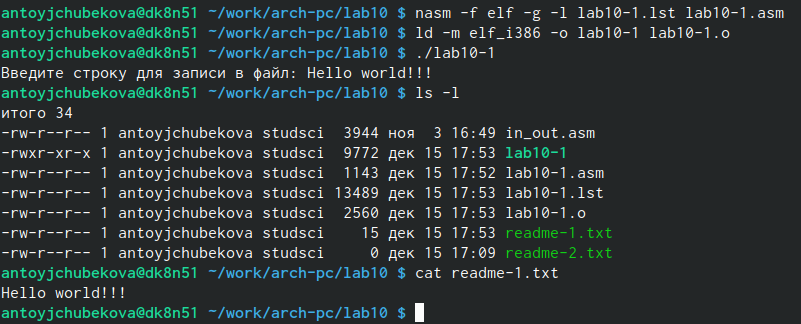

---
## Front matter
title: "Лабораторная работа №10"
subtitle: "Архитектура космпьютера"
author: "Тойчубекова Асель Нурлановна"

## Generic otions
lang: ru-RU
toc-title: "Содержание"

## Bibliography
bibliography: bib/cite.bib
csl: pandoc/csl/gost-r-7-0-5-2008-numeric.csl

## Pdf output format
toc: true # Table of contents
toc-depth: 2
lof: true # List of figures
lot: true # List of tables
fontsize: 12pt
linestretch: 1.5
papersize: a4
documentclass: scrreprt
## I18n polyglossia
polyglossia-lang:
  name: russian
  options:
	- spelling=modern
	- babelshorthands=true
polyglossia-otherlangs:
  name: english
## I18n babel
babel-lang: russian
babel-otherlangs: english
## Fonts
mainfont: PT Serif
romanfont: PT Serif
sansfont: PT Sans
monofont: PT Mono
mainfontoptions: Ligatures=TeX
romanfontoptions: Ligatures=TeX
sansfontoptions: Ligatures=TeX,Scale=MatchLowercase
monofontoptions: Scale=MatchLowercase,Scale=0.9
## Biblatex
biblatex: true
biblio-style: "gost-numeric"
biblatexoptions:
  - parentracker=true
  - backend=biber
  - hyperref=auto
  - language=auto
  - autolang=other*
  - citestyle=gost-numeric
## Pandoc-crossref LaTeX customization
figureTitle: "Рис."
tableTitle: "Таблица"
listingTitle: "Листинг"
lofTitle: "Список иллюстраций"
lotTitle: "Список таблиц"
lolTitle: "Листинги"
## Misc options
indent: true
header-includes:
  - \usepackage{indentfirst}
  - \usepackage{float} # keep figures where there are in the text
  - \floatplacement{figure}{H} # keep figures where there are in the text
---

# Цель работы

Целью лабораторной работы № 10 является приобретение навыков написания программ для работы с файлами.

# Задание

1. Изучить теоретический материал:\
- Права доступа к файлам;\
- Работа с файлами средствами NASM;\
- Открытие и создание файла;\
- Запись в файл;\
- Чтение файла;\
- Закрытие файла;\
- Изменение содержимого файла;\
- Удалени файла.
2. Написать программу записи в файл сообщения, опираясь на пример.
3. Попрактиковаться с изменениями прав доступа.
4. Задание для самостоятельной работы:\
- Напишите программу работающую по следующему алгоритму:\
• Вывод приглашения “Как Вас зовут?”\
• ввести с клавиатуры свои фамилию и имя\
• создать файл с именем name.txt\
• записать в файл сообщение “Меня зовут”\
• дописать в файл строку введенную с клавиатуры\
• закрыть файл.

# Теоретическое введение

## Права доступа к файлам ##

 ОС GNU/Linux является многопользовательской операционной системой. И для обеспечения защиты данных одного пользователя от действий других пользователей существуют специальные механизмы разграничения доступа к файлам. Кроме ограничения доступа, данный механизм позволяет разрешить другим пользователям доступ данным для совместной работы.

 Права доступа определяют набор действий (чтение, запись, выполнение), разрешённых для выполнения пользователям системы над файлами. Для каждого файла пользователь может входить в одну из трех групп: владелец, член группы владельца, все остальные. Для каждой из этих групп может быть установлен свой набор прав доступа. Владельцем файла является его создатель. Для предоставления прав доступа другому пользователю или другой группе командой:\
 -chown[ключ] <новый_пользователь>[:новая_группа] <файл>\
 или\
 -chgrp [ключи] < новая_группа > <файл>.
 
 Набор прав доступа задается тройками битов и состоит из прав на чтение, запись и исполнение файла. В символьном представлении он имеет вид строк rwx, где вместо любого символа может стоять дефис. Всего возможно 8 комбинаций, приведенных в таблице 10.1.
 
Буква означает наличие права (установлен в единицу второй бит триады r —чтение, первый бит w — запись, нулевой бит х — исполнение), а дефис означает отсутствие права (нулевое значение соответствующего бита). Также права доступа могут быть представлены как вось-меричное число. Так, права доступа rw- (чтение и запись, без исполнения) понимаются как
три двоичные цифры 110 или как восьмеричная цифра 6.

## Работа с файлами ##

В операционной системе Linux существуют различные методы управления файлами, например, такие как создание и открытие файла, только для чтения или для чтения и записи,добавления в существующий файл, закрытия и удаления файла, предоставление прав доступа.

Обработка файлов в операционной системе Linux осуществляется за счет использования определенных системных вызовов. Для корректной работы и доступа к файлу при его открытии или создании, файлу присваивается уникальный номер (16-битное целое число) – дескриптор файла.

Общий алгоритм работы с системными вызовами в Nasm можно представить в следующем виде:
1. Поместить номер системного вызова в регистр EAX;\
2. Поместить аргументы системного вызова в регистрах EBX, ECX и EDX;\
3. Вызов прерывания (int 80h);\
4. Результат обычно возвращается в регистр EAX\

## Открытие и создание файл ##

Для создания и открытия файла служит системный вызов sys_creat, который использует следующие аргументы: права доступа к файлу в регистре ECX, имя файла в EBX и номер системного вызова sys_creat (8) в EAX.

Для открытия существующего файла служит системный вызов sys_open, который использует следующие аргументы: права доступа к файлу в регистре EDX, режим доступа к файлу в регистр ECX, имя файла в EBX и номер системного вызова sys_open в eax.

## Запись в файл

Для записи в файл служит системный вызов sys_write, который использует следующие аргументы: количество байтов для записи в регистре EDX, строку содержимого для записи ECX, файловый дескриптор в EBX и номер системного вызова sys_write (4) в EAX.

Системный вызов возвращает фактическое количество записанных байтов в регистр EAX.В случае ошибки, код ошибки также будет находиться в регистре EAX. Прежде чем записывать в файл, его необходимо создать или открыть, что позволит получить дескриптор файла.

## Чтение файла ##

Для чтения данных из файла служит системный вызов sys_read, который использует следующие аргументы: количество байтов для чтения в регистре EDX, адрес в памяти для записи прочитанных данных в ECX, файловый дескриптор в EBX и номер системного вызова sys_read (3) в EAX. Как и для записи, прежде чем читать из файла, его необходимо открыть, что позволит получить дескриптор файла.

## Закрытие файла ##

Для правильного закрытия файла служит системный вызов sys_close, который использует один аргумент – дескриптор файла в регистре EBX. После вызова ядра происходит удаление дескриптора файла, а в случае ошибки, системный вызов возвращает код ошибки в регистр EAX.

## Изменение содержимого файла ##

Для изменения содержимого файла служит системный вызов sys_lseek, который использует следующие аргументы: исходная позиция для смещения EDX, значение смещения в байтах в ECX, файловый дескриптор в EBX и номер системного вызова sys_lseek (19) в EAX. Значение смещения можно задавать в байтах. Значения обозначающие исходную позиции могут быть следующими:\
• (0) – SEEK_SET (начало файла);\
• (1) – SEEK_CUR (текущая позиция);\
• (2) – SEEK_END (конец файла).\
В случае ошибки, системный вызов возвращает код ошибки в регистр EAX.

## Удаление файла ##

Удаление файла осуществляется системным вызовом sys_unlink, который использует один аргумент – имя файла в регистре EBX.

# Выполнение лабораторной работы

Создаем каталог для программ лабораторной работы №10, затем перейдем в него и создадим файлы lab10-1.asm, readme-1.txt и readme-2.txt (рис.1).

{#fig:001 width=70%}

Введем в файл текст программы записи в файл сообщения. (рис.2)

{#fig:002 width=70%}

Создадим исполняемый файл и запусим его (рис.3) Мы видим чтопрограмма рабоет правильно и в файл readme-1.txt записываются сообщение.

{#fig:003 width=70%}

С помощью команды chmod изменим права доступа к исполняемому файлу lab10-1, запретив его выполнение.(рис.4) Когда мы пытаемчся выполнить файл  нам отказывают в в доступе так как мы командой "chomod  u-x lab10-1" отказываем к доступу владельца.

{#fig:004 width=70%}

С помощью команды chmod изменим права доступа к файлу lab10-1.asm с исходным текстом программы, добавив права на исполнение.(рис.5).
Когда мы пробуем исполнить этот файл исполнение начинается, но не исполняется так как не содержит в себе команд для терминала.

{#fig:005 width=70%}

В соответствии с вариантом (14 вариант)   предоставим права доступа к файлу readme-1.txt представленные в символьном виде, а для файла readme-2.txt – в двочном виде.(рис.6) С помощью команды ls -l мы видим, что права доступа были предоставлны праильно.

{#fig:006 width=70%}

## Задание для самостоятельной работы ##

Напишем программу работающую по следующему алгоритму:\
• Вывод приглашения “Как Вас зовут?”\
• ввести с клавиатуры свои фамилию и имя\
• создать файл с именем name.txt\
• записать в файл сообщение “Меня зовут”\
• дописать в файл строку введенную с клавиатуры\
• закрыть файл.
(рис.7)
Исходная программа выгдялит ледующим образом:\

%include 'in_out.asm'\
SECTION .data\
filename db 'name.txt', 0h ; Имя файла\
msg db 'Как вас зовут?', 0h ; Сообщение\
msg1 db 'Меня зовут ', 0h\
SECTION .bss\
contents resb 255 ; переменная для вводимой строки\
SECTION .text\
global _start\
_start:
; --- Печать сообщения \
mov eax,msg
call sprintLF
; ---- Запись введеной с клавиатуры строки\
mov ecx, contents\
mov edx, 255\
call sread\
; --- Открытие существующего файла \
mov ecx, 0777o\
mov ebx, filename\
mov eax, 8\
int 80h\
mov ecx,2\
mov ebx, filename\
mov eax,5\
int 80h\
; --- Запись дескриптора файла \
mov esi, eax\
; --- Расчет длины введенной строки\
mov eax, msg1;  запишется количество\
call slen ; введенных байтов\
; --- Записываем в файл\
mov edx, eax\
mov ecx, msg1\
mov ebx, esi\
mov eax, 4\
int 80h\
mov eax,contents\
mov ebx,esi\
mov eax,4\
int 80h\
; --- Закрываем файл\
mov ebx, esi\
mov eax, 6\
int 80h\
call quit.

 {#fig:007 width=70%}

Создадим исполняемый файл и запустим его. Мы видим, что  программа работает правильно. С помошью команды ls видим, что файл был создан, и с помощью команды cat проверяем его содержимое. (рис.8)

{#fig:008 width=70%}

# Выводы

В ходе выполнения лабораторной работы № 10 я приобрела навыки написанич программы для работы с файлами. 

# Список литературы{.unnumbered}

-https://esystem.rudn.ru/course/view.php?id=4975
